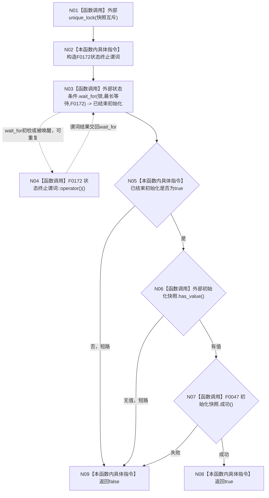

# CF-L4-0009 `自我线程::等待初始化完成` 现状流程图

图类型：现状流程图
代码版本：`a48a70b2d678dea64dd8228adb4f26f0badd9506`
覆盖文件：`海中鱼巣/线程/自我线程.ixx:215-228`
唯一根函数：F0045
完整签名：`bool 海中鱼巣::自我线程::等待初始化完成(std::chrono::milliseconds 最长等待) const`
参数：最长等待按值
返回结果：仅当等待谓词达到且已发布初始化快照完整成功时返回 `true`
调用图：`流程图/代码流程图/00_调用知识图谱.md`
逐行映射表：`流程图/代码流程图/L4/CF-L4-0009_自我线程_等待初始化完成_逐行代码映射表.md`
偏差清单：`流程图/代码流程图/00_规范偏差审计.md`
不得作为施工许可：是

## 项目源码调用合同

| ID | 函数 | 调用位置 / 次数 | 输入与结果 |
| --- | --- | --- | --- |
| F0172 | `bool 自我线程::等待初始化完成(...) const::<lambda@217-224>::operator()() const` | 217-224 / `wait_for` 可重复调用 | 捕获 `this`；终止状态之一时返回 `true` |
| F0047 | `bool 自我线程初始化快照::成功() const` | 227 / 1 | 仅在等待结束且快照有值时调用 |

## 等待与返回边界

谓词把运行中、正在停止、已停止、初始化失败和治理失败都视为“初始化阶段已经结束”；最终返回还必须具备成功快照，所以失败/停止状态不会被误报为初始化成功。快照读取发生在持有 `快照互斥` 的区间内。

状态写入者使用原子状态并通知条件变量，但不统一持有 `快照互斥`；丢失通知最多使本函数延迟到有界 `wait_for` 超时复核，不会形成无期限阻塞。未解析调用：0。
