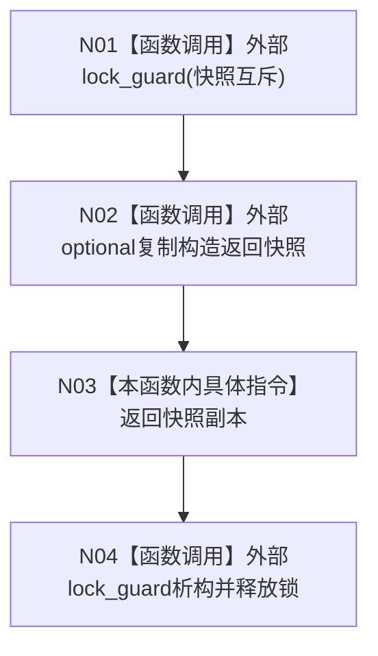

# CF-L4-0010 `自我线程::读取初始化快照` 现状流程图

图类型：现状流程图
代码版本：`a48a70b2d678dea64dd8228adb4f26f0badd9506`
覆盖文件：`海中鱼巣/线程/自我线程.ixx:230-233`
唯一根函数：F0046
完整签名：`std::optional<海中鱼巣::自我线程初始化快照> 海中鱼巣::自我线程::读取初始化快照() const`
参数：无
返回结果：在快照互斥保护下复制当前可选初始化快照并返回
调用图：`流程图/代码流程图/00_调用知识图谱.md`
逐行映射表：`流程图/代码流程图/L4/CF-L4-0010_自我线程_读取初始化快照_逐行代码映射表.md`
偏差清单：`流程图/代码流程图/00_规范偏差审计.md`
不得作为施工许可：是

本函数不返回内部 `optional` 的引用，调用方只能取得受锁保护时点的副本；返回后内部线程可继续更新自己的快照。锁取得或快照复制异常向上传播。项目源码被调函数 0；外部边界身份 1；未解析调用 0。
