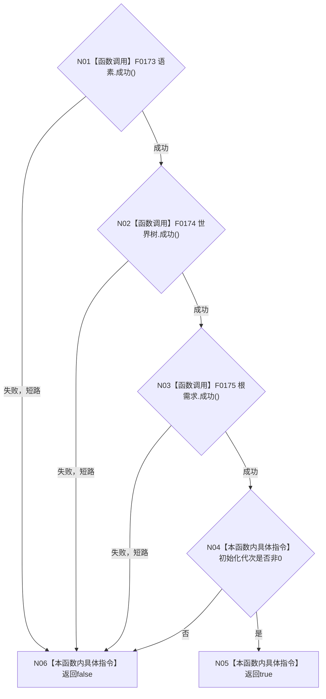

# CF-L4-0011 `自我线程初始化快照::成功` 现状流程图

图类型：现状流程图
代码版本：`a48a70b2d678dea64dd8228adb4f26f0badd9506`
覆盖文件：`海中鱼巣/线程/自我线程.ixx:56-61`
唯一根函数：F0047
完整签名：`bool 海中鱼巣::自我线程初始化快照::成功() const`
参数：无
返回结果：语素、世界树、根需求三个结果均成功且初始化代次非零时返回 `true`
调用图：`流程图/代码流程图/00_调用知识图谱.md`
逐行映射表：`流程图/代码流程图/L4/CF-L4-0011_自我线程初始化快照_成功_逐行代码映射表.md`
偏差清单：`流程图/代码流程图/00_规范偏差审计.md`
不得作为施工许可：是

项目源码调用依次为 F0173 `语素初始化结果::成功()`、F0174 `世界树初始化结果::成功()`、F0175 `自我根需求初始化结果::成功()`；三者严格按 `&&` 短路，不调用后续失败项。外部边界 0；未解析调用 0。
