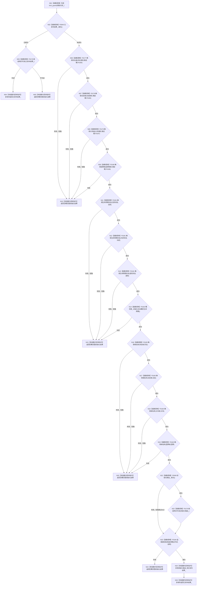

# CF-L4-0012 `概念图初始化服务::初始化四个根` 现状流程图

图类型：现状流程图
代码版本：`a48a70b2d678dea64dd8228adb4f26f0badd9506`
覆盖文件：`海中鱼巣/领域/初始化.概念图.ixx:98-141`
唯一根函数：F0048
完整签名：`海中鱼巣::概念图初始化结果 海中鱼巣::概念图初始化服务::初始化四个根()`
参数：无
返回结果：已发布结构完整可读或首次候选完整发布时返回四根结果；任一步失败返回空结果
调用图：`流程图/代码流程图/00_调用知识图谱.md`
逐行映射表：`流程图/代码流程图/L4/CF-L4-0012_概念图初始化服务_初始化四个根_逐行代码映射表.md`
偏差清单：`流程图/代码流程图/00_规范偏差审计.md`
不得作为施工许可：是

## 项目源码调用合同

| ID | 函数 | 调用位置 / 次数 | 输入与结果 |
| --- | --- | --- | --- |
| F0049 | `bool 概念图初始化结果::成功() const` | 100、135 / 2 | 已发布结果或候选；返回完整性 |
| F0176 | `bool 根结构仍可读(const 概念图初始化结果&) const` | 101、135 / 2 | 已发布结果或候选；完整读回 |
| F0177-F0180 | 四个 `确保根<唯一lambda类型>(...)` 模板实例 | 104-111 / 各1 | 目标项、类别、固定键、对应创建回调 |
| F0181 | `bool 确保生命周期状态(节点句柄&,概念生命周期阶段)` | 115-123 / 3 | 活跃、冷却、退役状态槽 |
| F0182 | `bool 概念图服务::初始化活动概念生命周期()` | 124 / 1 | 为四根初始化活跃生命周期 |
| F0183 | `bool 确保根名称(概念根初始化项&,const wchar_t*)` | 128-131 / 4 | 四根及固定人读名称 |
| F0184 | `bool 追根因检查(bool,const wchar_t*)` | 135-136 / 1 | 候选完整读回合取结果和说明 |
| F0185-F0188 | 四个根创建 lambda | 105、107、109、111 | 分别绑定给 F0177-F0180；实际调用在各模板实例图中展开 |

## 结构、发布与失败边界

成功路径按存在、动态、关系、因果顺序确保根，再确保活跃、冷却、退役三个抽象状态，初始化四根活跃生命周期，最后绑定四个人读名称。`已发布结果_` 只是服务私有最终缓存；真实根、状态、生命周期和名称结构在此前已经逐项进入仓库或服务登记。

顶层没有覆盖全包的事务或补偿。F0182 只对其本轮新增生命周期关系提供局部撤销；根主信息/节点、根登记、生命周期状态以及已经成功的前序名称不会因后续失败自动消失。中途失败保留 `初始化候选_` 供同一对象重试，但新初始化器或新概念图服务不能凭权威稳定主键恢复同一结构。未解析调用 0。
