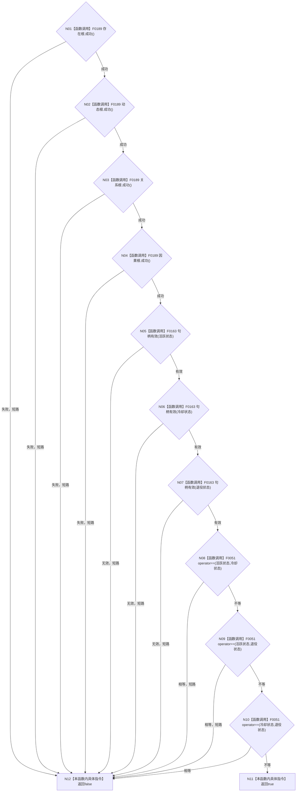

# CF-L4-0013 `概念图初始化结果::成功` 现状流程图

图类型：现状流程图
代码版本：`a48a70b2d678dea64dd8228adb4f26f0badd9506`
覆盖文件：`海中鱼巣/领域/初始化.概念图.ixx:49-60`
唯一根函数：F0049
完整签名：`bool 海中鱼巣::概念图初始化结果::成功() const`
参数：无
返回结果：四根项成功、三个状态句柄有效且两两不同时返回 `true`
调用图：`流程图/代码流程图/00_调用知识图谱.md`
逐行映射表：`流程图/代码流程图/L4/CF-L4-0013_概念图初始化结果_成功_逐行代码映射表.md`
偏差清单：`流程图/代码流程图/00_规范偏差审计.md`
不得作为施工许可：是

C++20 的三个 `!=` 表达式由项目 `operator==` 重写裁决，均按前置 `&&` 成功后才调用。项目源码被调函数身份为 F0189、F0163、F0051；未解析调用 0。
