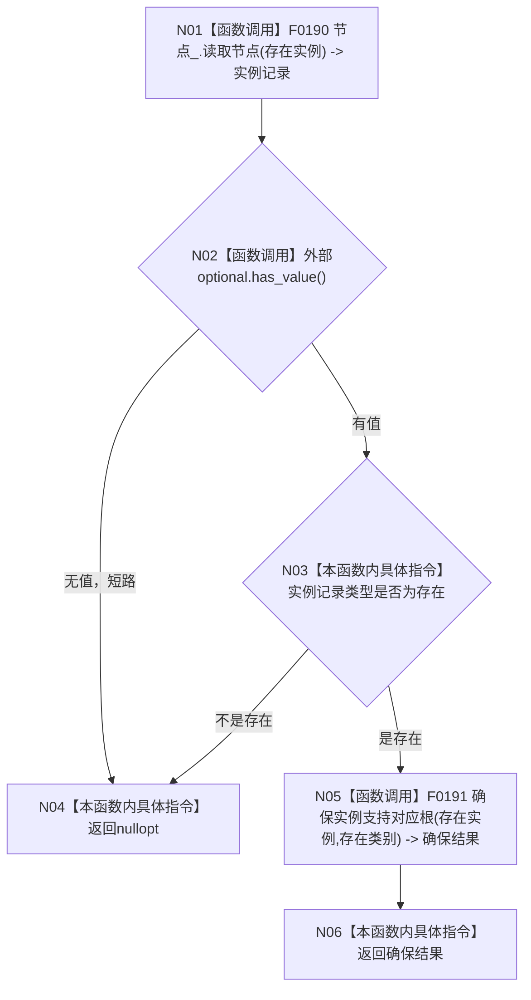

# CF-L4-0014 `概念图服务::确保存在实例根支持` 现状流程图

图类型：现状流程图
代码版本：`a48a70b2d678dea64dd8228adb4f26f0badd9506`
覆盖文件：`海中鱼巣/领域/概念图服务.h:1052-1059`
唯一根函数：F0050
完整签名：`std::optional<海中鱼巣::节点句柄> 海中鱼巣::概念图服务::确保存在实例根支持(海中鱼巣::节点句柄 存在实例)`
参数：存在实例句柄按值
返回结果：输入为可读存在节点时返回 F0191 的确保结果，否则返回 `nullopt`
调用图：`流程图/代码流程图/00_调用知识图谱.md`
逐行映射表：`流程图/代码流程图/L4/CF-L4-0014_概念图服务_确保存在实例根支持_逐行代码映射表.md`
偏差清单：`流程图/代码流程图/00_规范偏差审计.md`
不得作为施工许可：是

本函数本身只做输入节点类型准入，不直接创建关系；真正的根读取、支持关系幂等写入、双向读回和内部异常口径全部属于 F0191 的独立图。未解析调用 0。
