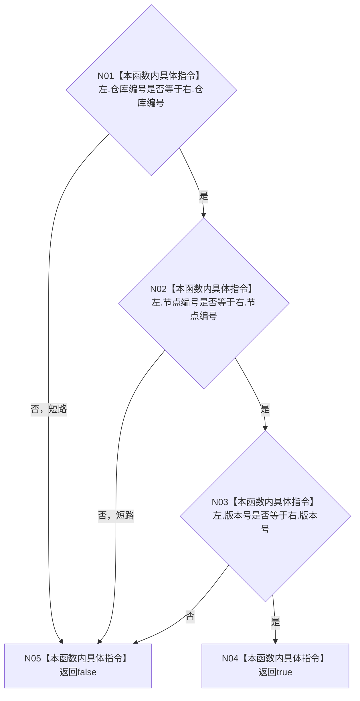

# CF-L4-0015 `节点句柄 operator==` 现状流程图

图类型：现状流程图
代码版本：`a48a70b2d678dea64dd8228adb4f26f0badd9506`
覆盖文件：`海中鱼巣/核心/句柄.h:139-141`
唯一根函数：F0051
完整签名：`bool 海中鱼巣::operator==(const 海中鱼巣::节点句柄& 左, const 海中鱼巣::节点句柄& 右)`
参数：两个节点句柄只读引用
返回结果：仓库编号、节点编号、版本号全部相等时返回 `true`
调用图：`流程图/代码流程图/00_调用知识图谱.md`
逐行映射表：`流程图/代码流程图/L4/CF-L4-0015_节点句柄_operator_equal_逐行代码映射表.md`
偏差清单：`流程图/代码流程图/00_规范偏差审计.md`
不得作为施工许可：是

项目源码被调函数 0；外部边界 0；未解析调用 0。
