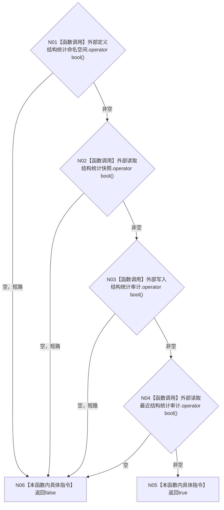

# CF-L4-0016 `数据库启动审计端口::完整` 现状流程图

图类型：现状流程图
代码版本：`a48a70b2d678dea64dd8228adb4f26f0badd9506`
覆盖文件：`海中鱼巣/适配/审计.数据库启动.ixx:25-30`
唯一根函数：F0052
完整签名：`bool 海中鱼巣::数据库启动审计端口::完整() const noexcept`
参数：无
返回结果：四个回调槽均非空时返回 `true`
调用图：`流程图/代码流程图/00_调用知识图谱.md`
逐行映射表：`流程图/代码流程图/L4/CF-L4-0016_数据库启动审计端口_完整_逐行代码映射表.md`
偏差清单：`流程图/代码流程图/00_规范偏差审计.md`
不得作为施工许可：是

本函数只检查四个 `std::function` 槽是否绑定，不调用任何审计能力。项目源码被调函数 0；外部边界身份 1；未解析调用 0。
