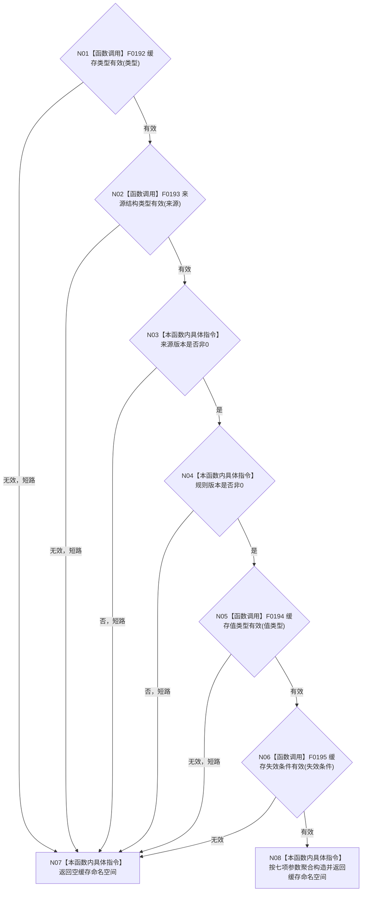

# CF-L4-0017 `统计服务::定义缓存命名空间` 现状流程图

图类型：现状流程图
代码版本：`a48a70b2d678dea64dd8228adb4f26f0badd9506`
覆盖文件：`海中鱼巣/领域/统计服务.h:243-254`
唯一根函数：F0053
完整签名：`海中鱼巣::缓存命名空间 海中鱼巣::统计服务::定义缓存命名空间(海中鱼巣::缓存类型 类型, 海中鱼巣::来源结构类型 来源, std::uint64_t 来源版本, std::uint64_t 规则版本, 海中鱼巣::缓存值类型 值类型, bool 可持久化, 海中鱼巣::缓存失效条件 失效条件) const`
参数：七项均按值
返回结果：全部身份字段有效时返回完整命名空间，否则返回值初始化空命名空间
调用图：`流程图/代码流程图/00_调用知识图谱.md`
逐行映射表：`流程图/代码流程图/L4/CF-L4-0017_统计服务_定义缓存命名空间_逐行代码映射表.md`
偏差清单：`流程图/代码流程图/00_规范偏差审计.md`
不得作为施工许可：是

`可持久化` 是被承载的策略字段，不是准入真假条件；因此 `false` 仍可形成有效命名空间。项目源码被调函数 4；外部边界 0；未解析调用 0。
