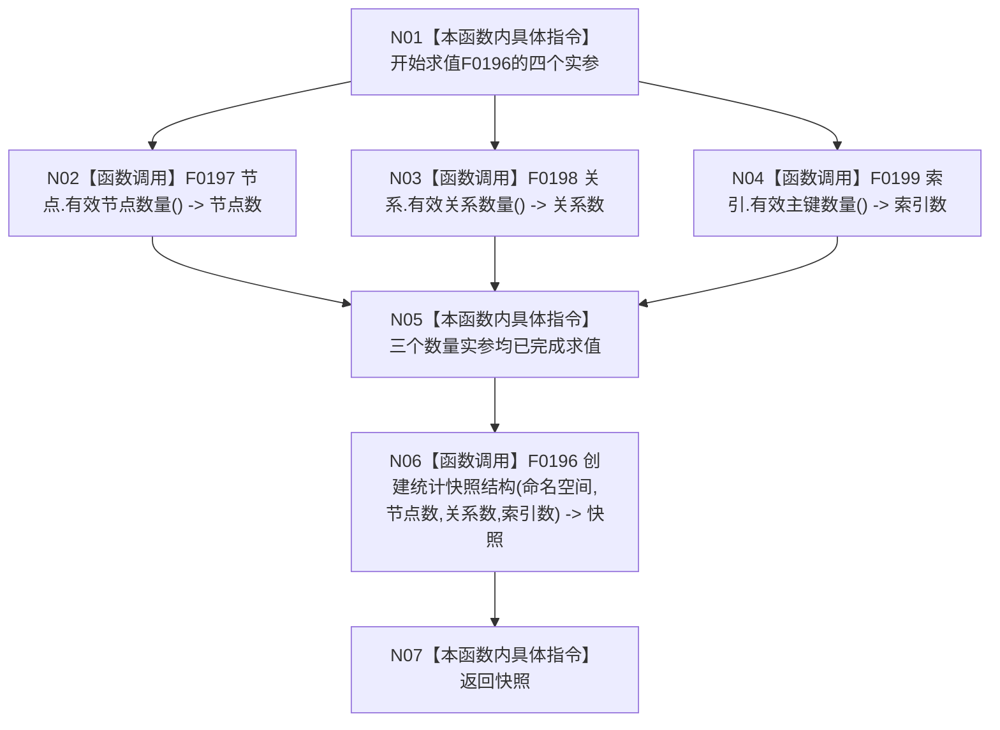

# CF-L4-0018 `统计服务::读取权威结构统计快照` 现状流程图

图类型：现状流程图
代码版本：`a48a70b2d678dea64dd8228adb4f26f0badd9506`
覆盖文件：`海中鱼巣/领域/统计服务.h:690-693`
唯一根函数：F0054
完整签名：`海中鱼巣::结构统计快照 海中鱼巣::统计服务::读取权威结构统计快照(海中鱼巣::缓存命名空间 命名空间, const 海中鱼巣::节点仓库& 节点, const 海中鱼巣::关系仓库& 关系, const 海中鱼巣::索引仓库& 索引) const`
参数：命名空间按值，三个仓库为只读引用
返回结果：以三个仓库分别读取的有效数量调用 F0196，透传其结构化快照
调用图：`流程图/代码流程图/00_调用知识图谱.md`
逐行映射表：`流程图/代码流程图/L4/CF-L4-0018_统计服务_读取权威结构统计快照_逐行代码映射表.md`
偏差清单：`流程图/代码流程图/00_规范偏差审计.md`
不得作为施工许可：是

N02、N03、N04 在同一函数调用表达式中属于不确定先后但彼此不交错的实参求值，图中分叉不声明并行执行。代码没有为三个仓库取得同一个结构事务令牌或统一读取时点，因此返回材料是三次独立权威读取的组合，不证明跨仓库同一瞬时快照。未解析调用 0。
