# CF-L4-0019 `SQL数据库适配::写入结构统计审计` 现状流程图

图类型：现状流程图
代码版本：`a48a70b2d678dea64dd8228adb4f26f0badd9506`
覆盖文件：`海中鱼巣/适配/SQL数据库适配.cpp:381-469`
唯一根函数：F0055
完整签名：`海中鱼巣::数据库操作结果 海中鱼巣::SQL数据库适配::写入结构统计审计(const 海中鱼巣::结构统计快照& 快照, std::wstring 来源入口) const`
参数：快照只读借用；来源入口按值持有
返回结果：返回结构化逻辑内拒绝、追根因错误、初始化失败透传或带非零审计编号的成功结果
调用图：`流程图/代码流程图/00_调用知识图谱.md`
逐行映射表：`流程图/代码流程图/L4/CF-L4-0019_SQL数据库适配_写入结构统计审计_逐行代码映射表.md`
偏差清单：`流程图/代码流程图/00_规范偏差审计.md`
不得作为施工许可：是

```mermaid
flowchart TD
    N01{"N01【函数调用】F0200 快照可写入(快照)"}
    N02{"N02【函数调用】外部来源入口.empty()"}
    N03{"N03【函数调用】外部来源入口.size()是否大于128"}
    N04{"N04【函数调用】F0201 数量可写入(节点数)"}
    N05{"N05【函数调用】F0201 数量可写入(关系数)"}
    N06{"N06【函数调用】F0201 数量可写入(索引数)"}
    N07["N07【函数调用】F0202 逻辑内失败(写入准入,说明)"]
    N08["N08【本函数内具体指令】返回逻辑内失败"]
    N09["N09【函数调用】F0203 初始化数据库() -> 初始化结果"]
    N10{"N10【本函数内具体指令】初始化是否成功"}
    N11["N11【本函数内具体指令】原样返回初始化结果"]
    N12["N12【本函数内具体指令】默认构造诊断字符串"]
    N13["N13【函数调用】F0204 ODBC连接()"]
    N14{"N14【函数调用】F0205 连接.打开(配置_,数据库,诊断)"}
    N15["N15【函数调用】F0202 逻辑内失败(连接数据库,诊断)"]
    N16["N16【本函数内具体指令】返回连接失败"]
    N17["N17【函数调用】F0206 连接.句柄() -> 连接句柄"]
    N18["N18【函数调用】F0207 ODBC语句(连接句柄)"]
    N19{"N19【函数调用】F0208 语句.可用()"}
    N20["N20【函数调用】F0212 追根因失败(分配语句)"]
    N21["N21【本函数内具体指令】返回分配失败"]
    N22["N22【本函数内具体指令】构造参数化INSERT与SCOPE_IDENTITY SQL"]
    N23["N23【函数调用】F0209 语句.句柄() -> 语句句柄"]
    N24["N24【函数调用】外部SQLPrepareW(语句句柄,SQL文本) -> 返回码"]
    N25{"N25【函数调用】F0210 ODBC成功(准备返回码)"}
    N26["N26【函数调用】F0211 读取ODBC诊断(语句句柄)"]
    N27["N27【函数调用】F0212 追根因失败(准备语句,诊断)"]
    N28["N28【本函数内具体指令】构造来源指示、五个int64数值及指示数组"]
    N29["N29【函数调用】外部SQLBindParameter绑定来源入口 -> 绑定结果"]
    N30{"N30【函数调用】F0210 ODBC成功(绑定结果)"}
    N31{"N31【本函数内具体指令】数值参数索引是否小于5"}
    N32["N32【函数调用】外部SQLBindParameter绑定当前数值参数 -> 绑定结果"]
    N33["N33【本函数内具体指令】索引递增"]
    N34{"N34【函数调用】F0210 ODBC成功(最终绑定结果)"}
    N35["N35【函数调用】F0211 读取ODBC诊断(语句句柄)"]
    N36["N36【函数调用】F0212 追根因失败(绑定参数,诊断)"]
    N37["N37【函数调用】外部SQLExecute(语句句柄) -> 执行返回码"]
    N38{"N38【函数调用】F0210 ODBC成功(执行返回码)"}
    N39["N39【函数调用】F0211 读取ODBC诊断(语句句柄)"]
    N40["N40【函数调用】F0212 追根因失败(执行写入,诊断)"]
    N41["N41【本函数内具体指令】列数置0"]
    N42["N42【函数调用】外部SQLNumResultCols(语句句柄,&列数) -> 返回码"]
    N43{"N43【函数调用】F0210 ODBC成功(列数返回码)"}
    N44{"N44【本函数内具体指令】列数是否为0"}
    N45["N45【函数调用】外部SQLMoreResults(语句句柄) -> 更多结果"]
    N46{"N46【本函数内具体指令】更多结果是否NO_DATA"}
    N47{"N47【函数调用】F0210 ODBC成功(更多结果)"}
    N48["N48【函数调用】F0211 读取ODBC诊断(语句句柄)"]
    N49["N49【函数调用】F0212 追根因失败(读取审计编号,诊断)"]
    N50["N50【函数调用】外部SQLFetch(语句句柄) -> Fetch结果"]
    N51{"N51【函数调用】F0210 ODBC成功(Fetch结果)"}
    N52["N52【函数调用】F0211 读取ODBC诊断(语句句柄)"]
    N53["N53【函数调用】F0212 追根因失败(读取审计编号,诊断)"]
    N54["N54【本函数内具体指令】审计编号置0"]
    N55{"N55【函数调用】F0213 读取整数列(语句句柄,1,审计编号)"}
    N56{"N56【本函数内具体指令】审计编号是否非0"}
    N57["N57【函数调用】F0212 追根因失败(无有效审计编号)"]
    N58["N58【函数调用】F0056 读取最近结构统计审计(1) -> 读回"]
    N59{"N59【本函数内具体指令】读回成功、恰一条且编号和三计数一致"}
    N60["N60【函数调用】外部诊断.empty()并选择读回说明"]
    N61["N61【函数调用】F0212 追根因失败(写后读回,说明,审计编号)"]
    N62["N62【本函数内具体指令】返回{true,false,false,审计编号}"]
    N63["N63【函数调用】F0214 ODBC语句析构并释放语句句柄"]
    N64["N64【函数调用】F0215 ODBC连接析构并关闭连接与环境"]
    N01 -- "否，短路" --> N07
    N01 -- "是" --> N02
    N02 -- "空" --> N07
    N02 -- "非空" --> N03
    N03 -- "超长" --> N07
    N03 -- "长度有效" --> N04
    N04 -- "否，短路" --> N07
    N04 -- "是" --> N05
    N05 -- "否，短路" --> N07
    N05 -- "是" --> N06
    N06 -- "否" --> N07 --> N08
    N06 -- "是" --> N09 --> N10
    N10 -- "否" --> N11
    N10 -- "是" --> N12 --> N13 --> N14
    N14 -- "失败" --> N15 --> N16 --> N64
    N14 -- "成功" --> N17 --> N18 --> N19
    N19 -- "不可用" --> N20 --> N21 --> N63 --> N64
    N19 -- "可用" --> N22 --> N23 --> N24 --> N25
    N25 -- "失败" --> N26 --> N27 --> N63
    N25 -- "成功" --> N28 --> N29 --> N30
    N30 -- "失败" --> N34
    N30 -- "成功" --> N31
    N31 -- "是" --> N32 --> N33 --> N30
    N31 -- "否" --> N34
    N34 -- "失败" --> N35 --> N36 --> N63
    N34 -- "成功" --> N37 --> N38
    N38 -- "失败" --> N39 --> N40 --> N63
    N38 -- "成功" --> N41 --> N42 --> N43
    N43 -- "失败" --> N50
    N43 -- "成功" --> N44
    N44 -- "列数非0" --> N50
    N44 -- "列数为0" --> N45 --> N46
    N46 -- "是" --> N48
    N46 -- "否" --> N47
    N47 -- "成功" --> N42
    N47 -- "失败" --> N48 --> N49 --> N63
    N50 --> N51
    N51 -- "失败" --> N52 --> N53 --> N63
    N51 -- "成功" --> N54 --> N55
    N55 -- "失败" --> N57 --> N63
    N55 -- "成功" --> N56
    N56 -- "否" --> N57
    N56 -- "是" --> N58 --> N59
    N59 -- "不一致" --> N60 --> N61 --> N63
    N59 -- "一致" --> N62 --> N63
    N63 --> N64
```

## 写入和错误边界

本函数未关闭 ODBC 默认自动提交，也没有显式事务、提交或回滚。`SQLExecute` 成功后审计行可能已经提交；随后取号、最近记录查询或字段比较失败只返回追根因错误，不删除该行。因此失败结果不能解释为“数据库未写入”，重试可能追加另一行。

写后读回使用 F0056 的 `TOP(1) ORDER BY 审计编号 DESC`，不是按本次 `SCOPE_IDENTITY` 查询；并发写入可使另一条记录成为最近记录。本函数还只比较审计编号和三项数量，不比较来源入口、来源版本、规则版本。`SQLNumResultCols` 失败会直接离开循环并继续 `SQLFetch`，原始阶段被折叠为读取审计编号失败。

数据库仅承载审计投影；本函数不写运行期节点、关系或索引机器事实，也没有日志、控制台或弹窗旁路。未解析调用 0。
