# CF-L4-0020 `SQL数据库适配::读取最近结构统计审计` 现状流程图

图类型：现状流程图
代码版本：`a48a70b2d678dea64dd8228adb4f26f0badd9506`
覆盖文件：`海中鱼巣/适配/SQL数据库适配.cpp:471-531`
唯一根函数：F0056
完整签名：`海中鱼巣::数据库查询结果 海中鱼巣::SQL数据库适配::读取最近结构统计审计(std::size_t 数量上限) const`
参数：数量上限按值传入，合法范围 1—100
返回结果：返回结构化操作结果及按审计编号降序排列的完整记录组；任一行读取失败时清空已读前缀
调用图：`流程图/代码流程图/00_调用知识图谱.md`
逐行映射表：`流程图/代码流程图/L4/CF-L4-0020_SQL数据库适配_读取最近结构统计审计_逐行代码映射表.md`
偏差清单：`流程图/代码流程图/00_规范偏差审计.md`
不得作为施工许可：是

```mermaid
flowchart TD
    N01["N01【本函数内具体指令】值初始化数据库查询结果"]
    N02{"N02【本函数内具体指令】数量上限是否在1—100"}
    N03["N03【函数调用】F0202 逻辑内失败(审计查询准入,说明)"]
    N04["N04【本函数内具体指令】把失败结果赋给返回结果.操作"]
    N05["N05【本函数内具体指令】返回空记录组结果"]
    N06["N06【函数调用】F0203 初始化数据库() -> 初始化结果"]
    N07{"N07【本函数内具体指令】初始化结果是否成功"}
    N08["N08【本函数内具体指令】把初始化结果赋给返回结果.操作"]
    N09["N09【本函数内具体指令】返回初始化失败结果"]
    N10["N10【本函数内具体指令】默认构造诊断字符串"]
    N11["N11【函数调用】F0204 ODBC连接()"]
    N12{"N12【函数调用】F0205 连接.打开(配置_,数据库,诊断)"}
    N13["N13【函数调用】F0202 逻辑内失败(连接审计数据库,move诊断)"]
    N14["N14【本函数内具体指令】把连接失败赋给返回结果.操作"]
    N15["N15【本函数内具体指令】返回连接失败结果"]
    N16["N16【函数调用】F0206 连接.句柄() -> 连接句柄"]
    N17["N17【函数调用】F0207 ODBC语句(连接句柄)"]
    N18{"N18【函数调用】F0208 语句.可用()"}
    N19["N19【函数调用】F0212 追根因失败(分配审计查询语句)"]
    N20["N20【本函数内具体指令】把分配失败赋给返回结果.操作"]
    N21["N21【本函数内具体指令】返回分配失败结果"]
    N22["N22【本函数内具体指令】默认构造SQL文本流"]
    N23["N23【函数调用】外部流插入数量上限与固定SELECT文本"]
    N24["N24【函数调用】外部SQL文本流.str() -> SQL文本"]
    N25["N25【函数调用】F0209 语句.句柄() -> 执行句柄"]
    N26["N26【函数调用】外部SQLExecDirectW(执行句柄,SQL文本) -> 返回码"]
    N27{"N27【函数调用】F0210 ODBC成功(执行返回码)"}
    N28["N28【函数调用】F0209 语句.句柄() -> 诊断句柄"]
    N29["N29【函数调用】F0211 读取ODBC诊断(语句句柄) -> 诊断"]
    N30["N30【函数调用】F0212 追根因失败(执行审计查询,诊断)"]
    N31["N31【本函数内具体指令】把执行失败赋给返回结果.操作"]
    N32["N32【本函数内具体指令】返回执行失败结果"]
    N33["N33【函数调用】F0209 语句.句柄() -> Fetch句柄"]
    N34["N34【函数调用】外部SQLFetch(Fetch句柄) -> 获取结果"]
    N35{"N35【本函数内具体指令】获取结果是否SQL_NO_DATA"}
    N36{"N36【函数调用】F0210 ODBC成功(获取结果)"}
    N37["N37【函数调用】F0209 语句.句柄() -> 诊断句柄"]
    N38["N38【函数调用】F0211 读取ODBC诊断(语句句柄) -> 诊断"]
    N39["N39【函数调用】F0212 追根因失败(读取审计查询结果,诊断)"]
    N40["N40【本函数内具体指令】赋失败结果并清空已读记录组"]
    N41["N41【本函数内具体指令】返回无半记录结果"]
    N42["N42【本函数内具体指令】值初始化一条数据库审计记录"]
    N43["N43【函数调用】F0209 语句.句柄() -> 第一列读取句柄"]
    N44{"N44【函数调用】F0213 读取整数列(1,审计编号)"}
    N45["N45【函数调用】F0209 语句.句柄() -> 第二列读取句柄"]
    N46{"N46【函数调用】F0216 读取文本列(2,记录时间)"}
    N47["N47【函数调用】F0209 语句.句柄() -> 第三列读取句柄"]
    N48{"N48【函数调用】F0216 读取文本列(3,来源入口)"}
    N49["N49【函数调用】F0209 语句.句柄() -> 第四列读取句柄"]
    N50{"N50【函数调用】F0213 读取整数列(4,来源版本)"}
    N51["N51【函数调用】F0209 语句.句柄() -> 第五列读取句柄"]
    N52{"N52【函数调用】F0213 读取整数列(5,规则版本)"}
    N53["N53【函数调用】F0209 语句.句柄() -> 第六列读取句柄"]
    N54{"N54【函数调用】F0213 读取整数列(6,节点数)"}
    N55["N55【函数调用】F0209 语句.句柄() -> 第七列读取句柄"]
    N56{"N56【函数调用】F0213 读取整数列(7,关系数)"}
    N57["N57【函数调用】F0209 语句.句柄() -> 第八列读取句柄"]
    N58{"N58【函数调用】F0213 读取整数列(8,索引数)"}
    N59["N59【函数调用】F0212 追根因失败(转换审计查询结果,说明)"]
    N60["N60【本函数内具体指令】赋失败结果并清空已读记录组"]
    N61["N61【本函数内具体指令】返回无半记录结果"]
    N62["N62【函数调用】外部记录组.push_back(move记录)"]
    N63["N63【本函数内具体指令】赋结构化成功操作结果"]
    N64["N64【本函数内具体指令】返回完整查询结果"]
    N65["N65【函数调用】F0214 ODBC语句析构并释放语句句柄"]
    N66["N66【函数调用】F0215 ODBC连接析构并关闭连接与环境"]
    N01 --> N02
    N02 -- "否" --> N03 --> N04 --> N05
    N02 -- "是" --> N06 --> N07
    N07 -- "否" --> N08 --> N09
    N07 -- "是" --> N10 --> N11 --> N12
    N12 -- "失败" --> N13 --> N14 --> N15 --> N66
    N12 -- "成功" --> N16 --> N17 --> N18
    N18 -- "不可用" --> N19 --> N20 --> N21 --> N65
    N18 -- "可用" --> N22 --> N23 --> N24 --> N25 --> N26 --> N27
    N27 -- "失败" --> N28 --> N29 --> N30 --> N31 --> N32 --> N65
    N27 -- "成功" --> N33 --> N34 --> N35
    N35 -- "是" --> N63 --> N64 --> N65
    N35 -- "否" --> N36
    N36 -- "失败" --> N37 --> N38 --> N39 --> N40 --> N41 --> N65
    N36 -- "成功" --> N42 --> N43 --> N44
    N44 -- "失败，短路" --> N59
    N44 -- "成功" --> N45 --> N46
    N46 -- "失败，短路" --> N59
    N46 -- "成功" --> N47 --> N48
    N48 -- "失败，短路" --> N59
    N48 -- "成功" --> N49 --> N50
    N50 -- "失败，短路" --> N59
    N50 -- "成功" --> N51 --> N52
    N52 -- "失败，短路" --> N59
    N52 -- "成功" --> N53 --> N54
    N54 -- "失败，短路" --> N59
    N54 -- "成功" --> N55 --> N56
    N56 -- "失败，短路" --> N59
    N56 -- "成功" --> N57 --> N58
    N58 -- "失败" --> N59 --> N60 --> N61 --> N65
    N58 -- "成功" --> N62 --> N33
    N65 --> N66
```

## 读取和错误边界

本函数把数量上限限定为 1—100，且只把该整数插入固定 SQL 语句；不存在来自自由文本的 SQL 注入。查询结果按审计编号降序读取，空结果集仍是成功。任一 Fetch、ODBC 诊断或列转换失败时，已经追加的记录全部清空，因此不会返回可读半记录组。

查询前调用 F0203，因而一个只读查询可能幂等创建数据库或表。文本列读取由固定 512 字符缓冲承载，`SQL_SUCCESS_WITH_INFO` 会被 F0210 视为成功；若数据库中存在超出缓冲的外部记录，F0216 可能静默返回截断文本。数据库记录仍仅是非权威审计投影，不写运行期仓库机器事实。未解析调用 0。
