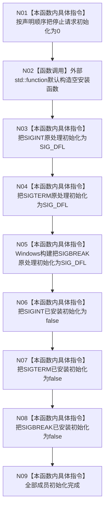

# CF-L4-0021 `停止信号租约::停止信号租约` 现状流程图

图类型：现状流程图
代码版本：`a48a70b2d678dea64dd8228adb4f26f0badd9506`
覆盖文件：`海中鱼巣/启动.程序运行宿主.ixx:44,69,76-84`
唯一根函数：F0057
完整签名：`海中鱼巣::停止信号租约::停止信号租约()`
参数：无
返回结果：构造函数无返回值；正常完成后得到全部成员处于初始态的空租约
调用图：`流程图/代码流程图/00_调用知识图谱.md`
逐行映射表：`流程图/代码流程图/L4/CF-L4-0021_停止信号租约_默认构造_逐行代码映射表.md`
偏差清单：`流程图/代码流程图/00_规范偏差审计.md`
不得作为施工许可：是

## 构造边界

F0057 是显式默认化构造函数，真实执行仍包含成员初始化。当前 Windows 构建按类内声明顺序形成图示状态；非 Windows 构建编译期移除 N05，而 N08 仍存在。静态成员 `当前停止信号租约` 不属于对象成员初始化序列，本函数不读取或写入它，也不安装任何信号处理器。

体内项目源码调用 0；唯一外部函数边界是空 `std::function` 的默认构造。未解析调用 0。
