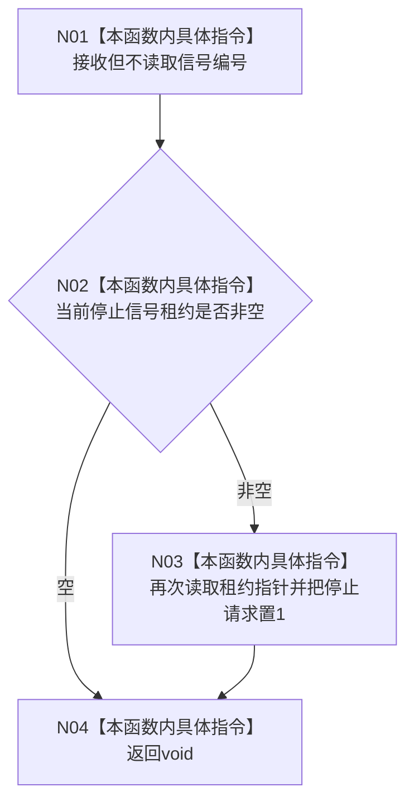

# CF-L4-0022 `接收程序停止信号` 现状流程图

图类型：现状流程图
代码版本：`a48a70b2d678dea64dd8228adb4f26f0badd9506`
覆盖文件：`海中鱼巣/启动.程序运行宿主.ixx:100-104`
唯一根函数：F0058
完整签名：`void 海中鱼巣::接收程序停止信号(int)`
参数：一个未命名的信号编号；现状不读取该参数
返回结果：`void`；存在当前租约时把其停止请求置 1
调用图：`流程图/代码流程图/00_调用知识图谱.md`
逐行映射表：`流程图/代码流程图/L4/CF-L4-0022_接收程序停止信号_逐行代码映射表.md`
偏差清单：`流程图/代码流程图/00_规范偏差审计.md`
不得作为施工许可：是

## 异步信号边界

本函数体没有项目源码函数调用、标准库调用、日志、分配、锁或界面操作；外部 CRT/操作系统只通过已登记回调入边异步进入本函数。`停止请求` 是 `volatile std::sig_atomic_t`，但到达它之前要两次读取普通静态裸指针 `当前停止信号租约`。安装发布、析构清空和异步回调之间没有同步，且两次读取形成值变化或悬空解引用窗口，因此不能把“最终写 sig_atomic_t”扩大声明为整条访问链已经异步安全。

参数信号编号被忽略，所有已注册信号共享同一置位行为。未解析调用 0。
