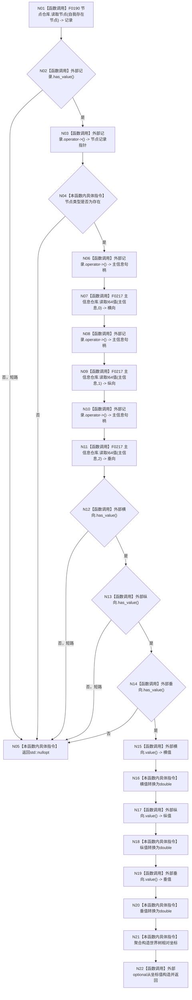

# CF-L4-0023 `世界树初始化服务::读取自我相对坐标` 现状流程图

图类型：现状流程图
代码版本：`a48a70b2d678dea64dd8228adb4f26f0badd9506`
覆盖文件：`海中鱼巣/领域/初始化.世界树.ixx:88-104`
唯一根函数：F0059
完整签名：`std::optional<海中鱼巣::世界树相对坐标> 海中鱼巣::世界树初始化服务::读取自我相对坐标(海中鱼巣::节点句柄 自我存在节点) const`
参数：自我存在节点句柄按值传入
返回结果：节点不是存在类型或任一坐标槽缺失时返回 `std::nullopt`；否则返回三个 I64 值转换形成的坐标值
调用图：`流程图/代码流程图/00_调用知识图谱.md`
逐行映射表：`流程图/代码流程图/L4/CF-L4-0023_世界树初始化服务_读取自我相对坐标_逐行代码映射表.md`
偏差清单：`流程图/代码流程图/00_规范偏差审计.md`
不得作为施工许可：是

## 读取、所有权和一致性边界

服务只借用主信息仓库和节点仓库；输入句柄按值，返回 optional 完全拥有坐标副本，不泄露仓库引用、锁或事务许可。本函数零写入、零日志。

节点记录和三个 I64 槽由四个独立仓库调用读取，没有共享事务令牌或统一版本；并发变更时可能组合不同读取时点。函数只验证节点类型为“存在”，不验证该句柄确为当前自我或属于目标世界树。三槽通过位置 0/1/2 承载且转为 double，绝对值超过 2^53 时会丢失整数精度。未解析调用 0。
