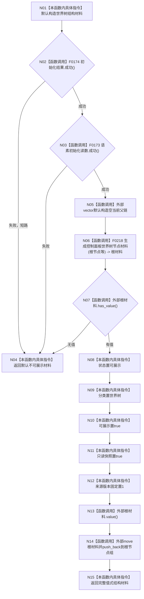

# CF-L4-0024 `生成控制面板世界树结构材料` 现状流程图

图类型：现状流程图
代码版本：`a48a70b2d678dea64dd8228adb4f26f0badd9506`
覆盖文件：`海中鱼巣/界面/投影.控制面板启动.ixx:128-152`
唯一根函数：F0060
完整签名：`海中鱼巣::控制面板树结构材料 海中鱼巣::生成控制面板世界树结构材料(const 海中鱼巣::节点仓库& 节点, const 海中鱼巣::关系仓库& 关系, const 海中鱼巣::世界树初始化结果& 初始化结果, const 海中鱼巣::语素初始化结果& 语素初始化读数, const std::optional<海中鱼巣::世界树相对坐标>& 自我相对坐标)`
参数：五项输入均为只读借用
返回结果：返回按值拥有完整根树的只读投影材料；任一前置或递归生成失败时返回默认不可展示材料
调用图：`流程图/代码流程图/00_调用知识图谱.md`
逐行映射表：`流程图/代码流程图/L4/CF-L4-0024_生成控制面板世界树结构材料_逐行代码映射表.md`
偏差清单：`流程图/代码流程图/00_规范偏差审计.md`
不得作为施工许可：是

## 投影与一致性边界

本函数不直接读取节点仓库或关系仓库；非平凡递归读取全部发生在 F0218，必须由其独立流程图表达。局部父链只在本次递归期间存活，成功根材料整体移动进入返回 DTO；返回材料不持有仓库引用。

`只读快照=true` 仅说明投影不能写业务事实，不证明递归期间的节点和关系读取共享同一仓库版本。`来源版本` 固定为 1，成功路径也未填写真实节点投影数量。失败原因全部折叠为默认不可展示材料。未解析调用 0。
