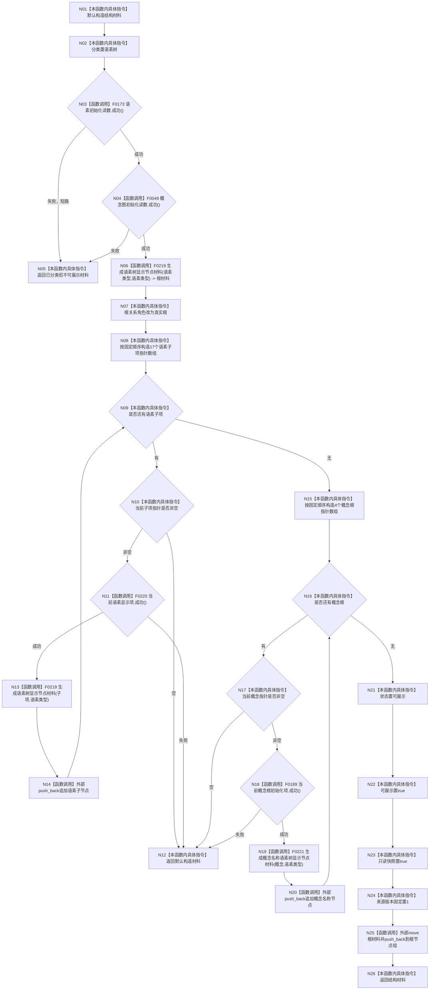

# CF-L4-0025 `生成控制面板语素树结构材料` 现状流程图

图类型：现状流程图
代码版本：`a48a70b2d678dea64dd8228adb4f26f0badd9506`
覆盖文件：`海中鱼巣/界面/投影.控制面板启动.ixx:187-233`
唯一根函数：F0061
完整签名：`海中鱼巣::控制面板树结构材料 海中鱼巣::生成控制面板语素树结构材料(const 海中鱼巣::语素初始化结果& 语素初始化读数, const 海中鱼巣::概念图初始化结果& 概念图初始化读数)`
参数：语素初始化结果和概念图初始化结果均为只读借用
返回结果：成功时返回一棵含 1 根、17 个语素项和 4 个概念名称项的值式树；任一前置或逐项检查失败时返回不可展示材料
调用图：`流程图/代码流程图/00_调用知识图谱.md`
逐行映射表：`流程图/代码流程图/L4/CF-L4-0025_生成控制面板语素树结构材料_逐行代码映射表.md`
偏差清单：`流程图/代码流程图/00_规范偏差审计.md`
不得作为施工许可：是

## 投影与失败形状

成功结果的固定树规模是 22 个节点，但本函数没有更新 `真实节点投影数量`，该字段保持 0。初始化前置失败返回已经标记为语素树的材料；17 项或 4 项循环中失败则执行 `return {}`，分类恢复为 DTO 默认的世界树，两个失败路径形状不一致。

所有输出均按值拥有，不保留输入引用，不写仓库或数据库。`来源版本` 固定为 1，不是仓库或初始化事实版本。未解析调用 0。
