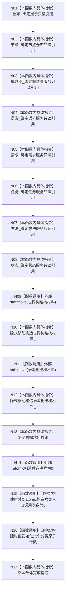

# CF-L4-0026 `控制面板服务::控制面板服务` 现状流程图

图类型：现状流程图
代码版本：`a48a70b2d678dea64dd8228adb4f26f0badd9506`
覆盖文件：`海中鱼巣/领域/控制面板服务.h:254-277,1788-1803`
唯一根函数：F0062
完整签名：`海中鱼巣::控制面板服务::控制面板服务(const 海中鱼巣::显示服务& 显示, const 海中鱼巣::节点仓库& 节点, const 海中鱼巣::概念图服务& 概念图, const 海中鱼巣::语素服务& 语素, const 海中鱼巣::需求服务& 需求, const 海中鱼巣::任务服务& 任务, const 海中鱼巣::方法服务& 方法, const 海中鱼巣::状态服务& 状态, 海中鱼巣::控制面板树结构材料 世界树结构材料, 海中鱼巣::控制面板树结构材料 语素树结构材料, std::array<海中鱼巣::节点句柄, 2> 根需求组)`
参数：八个服务/仓库只读借用；两份树材料及根需求数组按值接收
返回结果：构造函数无返回值；正常完成后对象借用八个外部服务并拥有两份树材料和根需求数组
调用图：`流程图/代码流程图/00_调用知识图谱.md`
逐行映射表：`流程图/代码流程图/L4/CF-L4-0026_控制面板服务_构造_逐行代码映射表.md`
偏差清单：`流程图/代码流程图/00_规范偏差审计.md`
不得作为施工许可：是

## 所有权与生命周期

八个引用成员不拥有其目标，调用方必须保证这些仓库和服务活得比控制面板服务更久。两份树材料和根需求数组由对象按值拥有；构造后不依赖实参材料继续存活。初始化顺序由成员声明顺序裁决，而不是初始化列表书写顺序。候选序号始终初始化为 0；两个自检计数成员仅在 `HY_EGO_ENABLE_STRUCTURE_COMMIT_FAULT_SELF_TEST` 构建中存在并初始化。

本函数没有项目源码被调函数。两个 `std::move` 与随后发生的编译器隐式材料移动构造分别成节点；当前成员中的标准 vector 移动为 `noexcept`。生产调用点传入左值材料时，真正可能分配并抛异常的深复制发生在进入本函数之前。本函数不校验树材料或根需求句柄，构造成功只证明对象成员成形。未解析调用 0。
