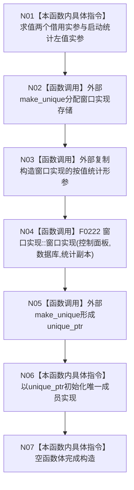

# CF-L4-0027 `控制面板窗口::控制面板窗口` 现状流程图

图类型：现状流程图
代码版本：`a48a70b2d678dea64dd8228adb4f26f0badd9506`
覆盖文件：`海中鱼巣/界面/控制面板窗口.cpp:1699-1703`；成员证据 `海中鱼巣/界面/控制面板窗口.h:40-55`
唯一根函数：F0063
完整签名：`海中鱼巣::控制面板窗口::控制面板窗口(const 海中鱼巣::控制面板服务& 控制面板, const 海中鱼巣::SQL数据库适配& 数据库, 海中鱼巣::结构统计快照 启动结构统计)`
参数：两个服务只读借用；启动结构统计按值接收
返回结果：构造函数无返回值；成功后唯一拥有一个完整窗口实现对象
调用图：`流程图/代码流程图/00_调用知识图谱.md`
逐行映射表：`流程图/代码流程图/L4/CF-L4-0027_控制面板窗口_构造_逐行代码映射表.md`
偏差清单：`流程图/代码流程图/00_规范偏差审计.md`
不得作为施工许可：是

## 所有权与异常边界

外层窗口唯一拥有 PImpl；窗口实现只借用控制面板服务和数据库适配，调用方必须保证二者覆盖窗口生命周期。启动统计从调用方到外层按值参数、再到内层按值参数，最后还会在 F0222 中赋给快照成员，代码合同存在多次复制。

分配或 F0222 构造失败时，`make_unique` 释放存储，外层对象不完成构造；异常不转为结构化窗口结果。构造成功只证明实现对象成形，不证明窗口类、原生窗口或投影材料已经可用。未解析调用 0。
