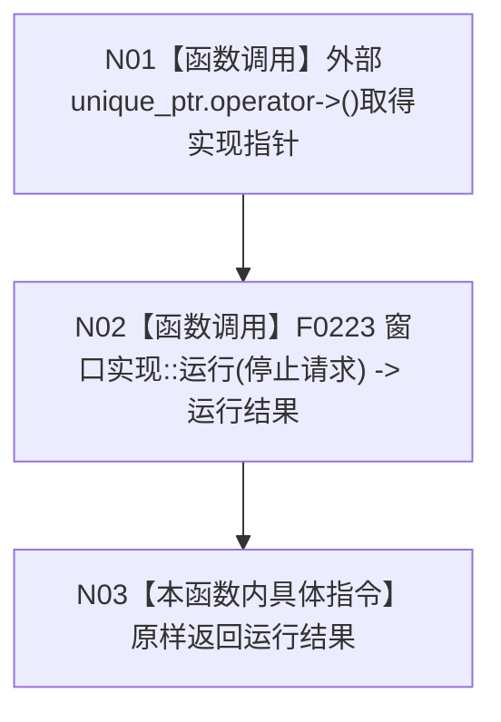

# CF-L4-0028 `控制面板窗口::运行` 现状流程图

图类型：现状流程图
代码版本：`a48a70b2d678dea64dd8228adb4f26f0badd9506`
覆盖文件：`海中鱼巣/界面/控制面板窗口.cpp:1707-1709`
唯一根函数：F0064
完整签名：`海中鱼巣::控制面板窗口运行结果 海中鱼巣::控制面板窗口::运行(const volatile std::sig_atomic_t* 停止请求)`
参数：可空的外部停止请求指针，按借用传入
返回结果：原样返回窗口实现的结构化运行结果
调用图：`流程图/代码流程图/00_调用知识图谱.md`
逐行映射表：`流程图/代码流程图/L4/CF-L4-0028_控制面板窗口_运行_逐行代码映射表.md`
偏差清单：`流程图/代码流程图/00_规范偏差审计.md`
不得作为施工许可：是

F0064 是严格薄转发，不创建窗口、不执行消息循环、不调用 Win32 API，也不读取停止位；全部非平凡过程属于 F0223 的独立流程图。公开参数允许空指针且本函数不拒绝；当前正式调用点传入非空租约字段。重复调用、异常和结构化错误覆盖由 F0223 审计。未解析调用 0。
