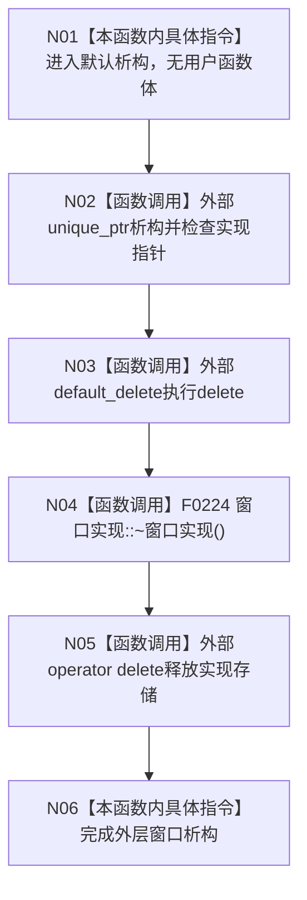

# CF-L4-0029 `控制面板窗口::~控制面板窗口` 现状流程图

图类型：现状流程图
代码版本：`a48a70b2d678dea64dd8228adb4f26f0badd9506`
覆盖文件：`海中鱼巣/界面/控制面板窗口.cpp:1705`；成员证据 `海中鱼巣/界面/控制面板窗口.h:40-55`
唯一根函数：F0065
完整签名：`海中鱼巣::控制面板窗口::~控制面板窗口()`
参数：无显式参数
返回结果：析构函数无返回值；结束后 PImpl 存储释放
调用图：`流程图/代码流程图/00_调用知识图谱.md`
逐行映射表：`流程图/代码流程图/L4/CF-L4-0029_控制面板窗口_析构_逐行代码映射表.md`
偏差清单：`流程图/代码流程图/00_规范偏差审计.md`
不得作为施工许可：是

F0065 只拥有一个 `unique_ptr`，不直接销毁字体、快捷键或窗口类；这些资源属于 F0224，必须在其单函数图展开。当前默认析构为 `noexcept`，没有结构化清理失败结果；被调析构若异常逃逸会终止进程。未解析调用 0。
