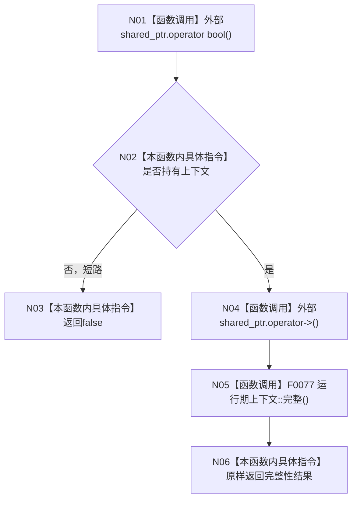

# CF-L4-0030 `运行期上下文租约::有效` 现状流程图

图类型：现状流程图
代码版本：`a48a70b2d678dea64dd8228adb4f26f0badd9506`
覆盖文件：`海中鱼巣/启动.运行期上下文.ixx:195,203`
唯一根函数：F0066
完整签名：`bool 海中鱼巣::运行期上下文租约::有效() const`
参数：无显式参数
返回结果：没有上下文或上下文不完整时为假；非空且完整时为真
调用图：`流程图/代码流程图/00_调用知识图谱.md`
逐行映射表：`流程图/代码流程图/L4/CF-L4-0030_运行期上下文租约_有效_逐行代码映射表.md`
不得作为施工许可：是

租约通过 shared_ptr 共享拥有上下文。本函数不复制引用计数、不写结构；“有效”同时包含指针存活和深层完整性复核，不只是轻量句柄检查。F0077 异常会穿透，且本次真值不冻结后续多步读取的统一版本。未解析调用 0。
