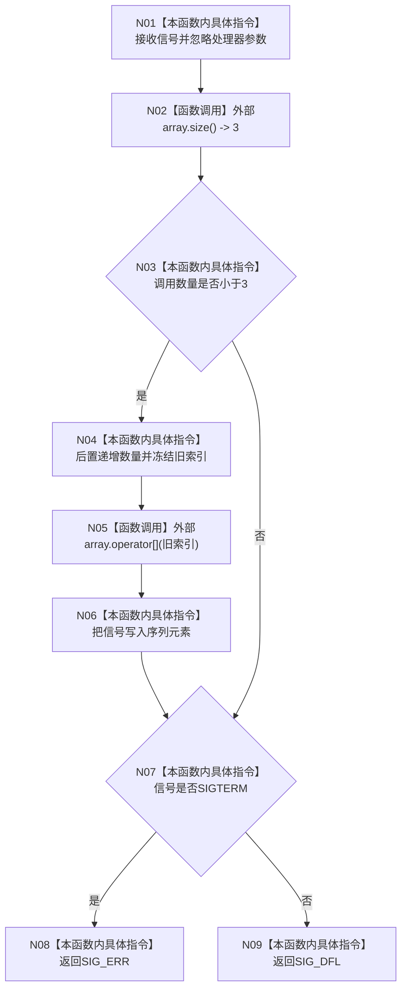

# CF-L4-0031 `第二次失败安装 lambda` 现状流程图

图类型：现状流程图
代码版本：`4b80f1617dd70ec7a19e1a34efa9da768dce8927`
源码 blob：`d2581161faef19cb494366ee32886ae2b12ee190`
覆盖文件：`海中鱼巣/启动.应用程序.ixx:290-295`
唯一根函数：F0067
完整签名：`海中鱼巣::程序信号处理函数 海中鱼巣::运行入口端口合同自检()::<lambda@启动.应用程序.ixx:289>::operator()(int 信号, 海中鱼巣::程序信号处理函数) const`
参数：信号编号按值；第二个处理器参数未命名且不读取
返回结果：SIGTERM 返回 SIG_ERR，其它信号返回 SIG_DFL
调用图：`流程图/代码流程图/00_调用知识图谱.md`
逐行映射表：`流程图/代码流程图/L4/CF-L4-0031_第二次失败安装lambda_逐行代码映射表.md`
不得作为施工许可：是

lambda 仅按引用捕获三元素序列和调用计数。三次解析回调形成 `SIGINT,SIGTERM,SIGINT`；容量满后额外回调不会留下证据。第二参数被忽略，因此该自检不证明安装阶段传入了正确处理器，也不验证真实 CRT 信号副作用。项目源码出边 0，未解析调用 0。
