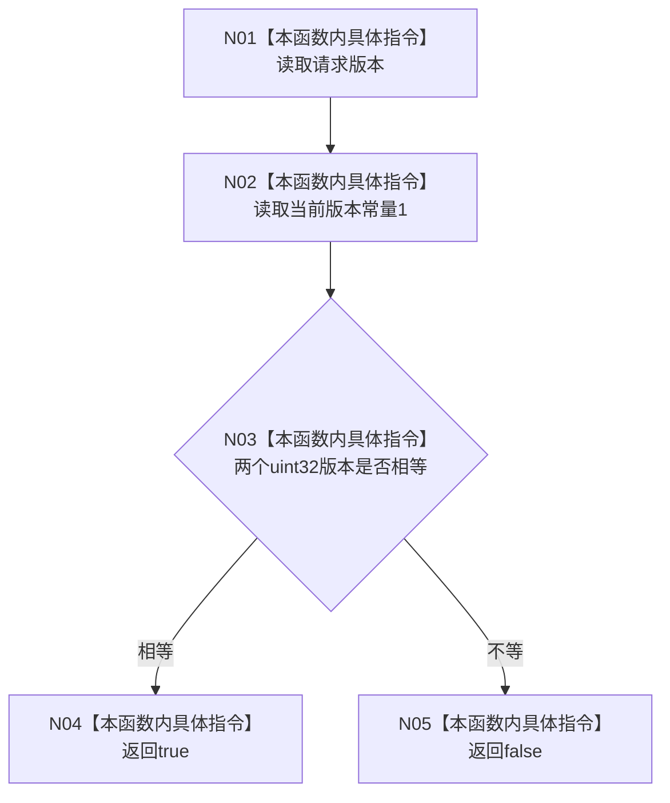

# CF-L4-0032 `生产运行期启动请求::有效` 现状流程图

图类型：现状流程图
代码版本：`a48a70b2d678dea64dd8228adb4f26f0badd9506`
覆盖文件：`海中鱼巣/生产运行期配置.数据.h:12,92-98`
唯一根函数：F0068
完整签名：`bool 海中鱼巣::生产运行期启动请求::有效() const noexcept`
参数：无显式参数
返回结果：请求版本严格等于当前版本 1 时为真，否则为假
调用图：`流程图/代码流程图/00_调用知识图谱.md`
逐行映射表：`流程图/代码流程图/L4/CF-L4-0032_生产运行期启动请求_有效_逐行代码映射表.md`
不得作为施工许可：是

本函数零调用、零写入、零异常，只证明版本严格匹配，不能扩大为生产运行期具备其它启动前置。版本不匹配是逻辑内 false；函数不区分过旧、过新或字段来源。未解析调用 0。
