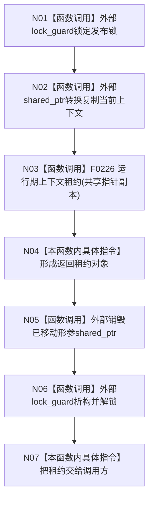

# CF-L4-0033 `运行期上下文宿主::读取租约` 现状流程图

图类型：现状流程图
代码版本：`a48a70b2d678dea64dd8228adb4f26f0badd9506`
覆盖文件：`海中鱼巣/启动.运行期上下文.ixx:233-236,244-245`
唯一根函数：F0069
完整签名：`海中鱼巣::运行期上下文租约 海中鱼巣::运行期上下文宿主::读取租约() const`
参数：无；返回按值租约

锁内复制 shared_ptr 并构造租约，解锁后租约仍共享拥有原上下文。空宿主正常返回空租约；没有结构化“尚未发布”状态。未解析调用 0。
