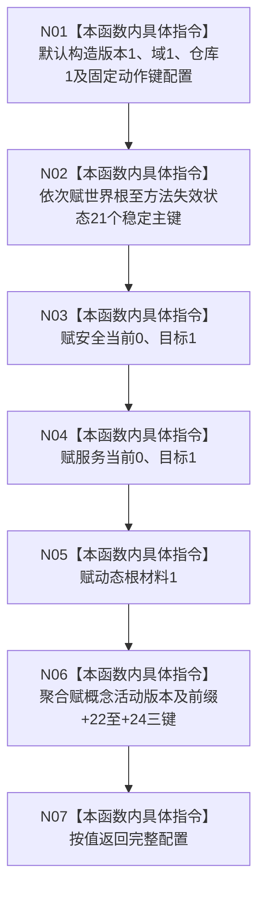

# CF-L4-0034 `读取生产运行期固定配置` 现状流程图

图类型：现状流程图
代码版本：`a48a70b2d678dea64dd8228adb4f26f0badd9506`
覆盖文件：`海中鱼巣/生产运行期配置.数据.h:11-62`
唯一根函数：F0070
完整签名：`海中鱼巣::生产运行期配置 海中鱼巣::读取生产运行期固定配置() noexcept`
参数：无；返回完整固定配置值

本函数单一路径、零调用、零外部输入。N02 在逐行映射中保持 21 项精确顺序，图上按同一赋值族压缩。返回只生成候选，不执行有效性检查。未解析调用 0。
