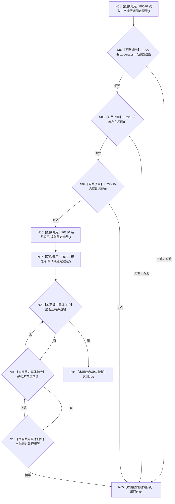

# CF-L4-0035 `生产运行期配置::有效` 现状流程图

图类型：现状流程图
代码版本：`a48a70b2d678dea64dd8228adb4f26f0badd9506`
覆盖文件：`海中鱼巣/生产运行期配置.数据.h:77-90`
唯一根函数：F0071
完整签名：`bool 海中鱼巣::生产运行期配置::有效() const noexcept`
参数：无；返回唯一固定配置与子合同及跨组键唯一性是否全部成立

本函数首先要求与唯一固定配置完全相等，再验证两个子结构，最后最多比较 21×3 个跨组稳定键；任一失败都是逻辑内 false。动作键不进入跨组比较。未解析调用 0。
