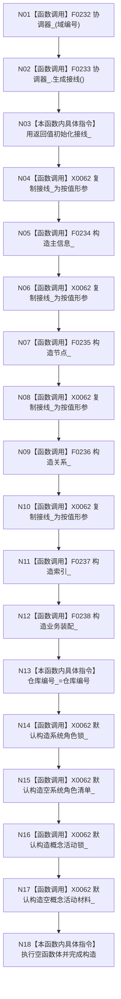

# CF-L4-0036 `运行期上下文::运行期上下文` 三参数构造现状流程图

图类型：现状流程图
代码版本：`a48a70b2d678dea64dd8228adb4f26f0badd9506`
覆盖文件：`海中鱼巣/启动.运行期上下文.ixx:41-54,178-189`
唯一根函数：F0072
完整签名：`海中鱼巣::运行期上下文::运行期上下文(std::uint64_t 域编号, std::uint64_t 仓库编号, std::uint64_t 稳定动作键)`
参数：三个无符号编号均按值；返回：无，正常完成只表示对象构造完成

成员严格按声明顺序构造。任一构造调用抛出异常时，已完成成员按逆序析构；本函数没有结构化失败结果。构造完成时两份初始化材料仍为空，因此不等于上下文业务完整。未解析调用 0。
