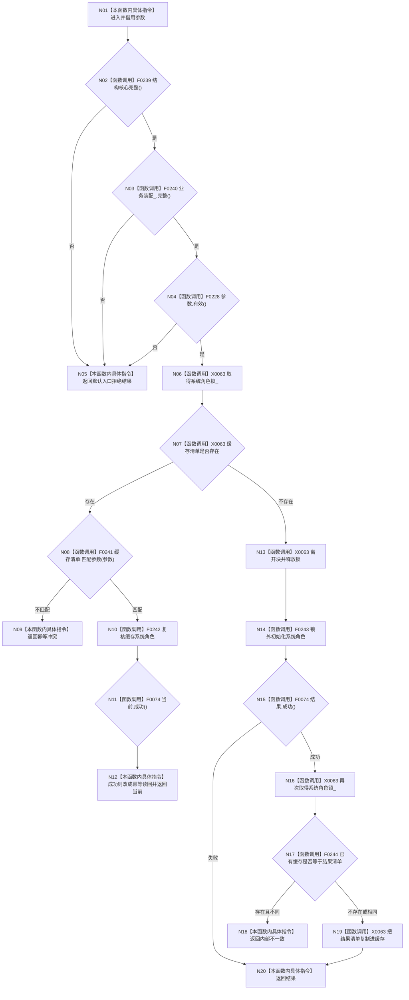

# CF-L4-0037 `运行期上下文::初始化系统角色` 现状流程图

图类型：现状流程图
代码版本：`a48a70b2d678dea64dd8228adb4f26f0badd9506`
覆盖文件：`海中鱼巣/启动.运行期上下文.ixx:95-116`
唯一根函数：F0073
完整签名：`海中鱼巣::系统角色初始化结果 海中鱼巣::运行期上下文::初始化系统角色(const 海中鱼巣::系统角色初始化参数& 参数)`
参数：只读借用初始化参数；返回：系统角色初始化结构化结果

第一把锁只保护缓存判定，空缓存路径先解锁再执行结构初始化；第二把锁串行发布值式清单。并发初始化若已提交出不同清单，后到路径返回内部不一致但不回滚已经结束的下层结构事务。未解析调用 0。
