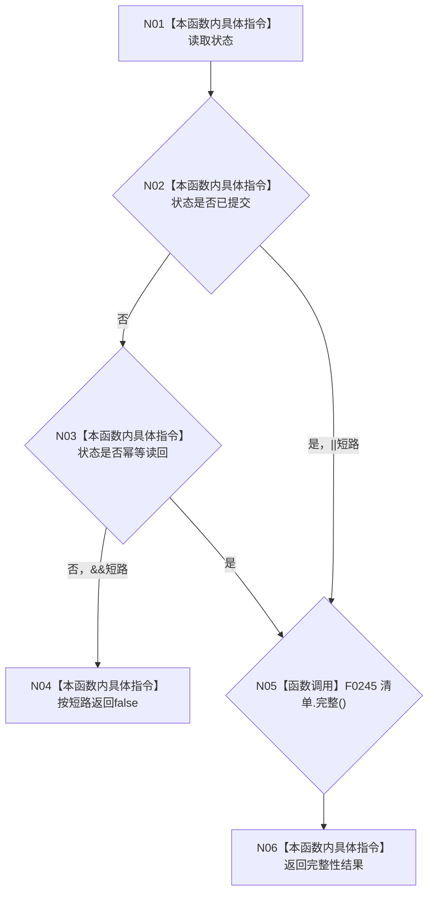

# CF-L4-0038 `系统角色初始化结果::成功` 现状流程图

图类型：现状流程图
代码版本：`a48a70b2d678dea64dd8228adb4f26f0badd9506`
覆盖文件：`海中鱼巣/领域/系统角色清单.数据.h:290-298`
唯一根函数：F0074
完整签名：`bool 海中鱼巣::系统角色初始化结果::成功() const noexcept`
参数：无；隐式 `this` 只读；返回：成功状态且清单完整时为 true

`已提交`和`幂等读回`都只是清单校验的前置候选；任一成功状态都不能绕过 F0245。其它状态完全不读取清单内部。未解析调用 0。
