# CF-L4-0039 `运行期上下文::初始化概念活动` 现状流程图

图类型：现状流程图
代码版本：`a48a70b2d678dea64dd8228adb4f26f0badd9506`
覆盖文件：`海中鱼巣/启动.运行期上下文.ixx:129-153`
唯一根函数：F0075
完整签名：`海中鱼巣::概念活动初始化结果 海中鱼巣::运行期上下文::初始化概念活动(const 海中鱼巣::概念活动初始化参数& 参数)`
参数：只读借用初始化参数；返回：概念活动初始化结构化结果

```mermaid
flowchart TD
    N01{"N01【函数调用】F0239 结构核心完整()"}
    N02{"N02【本函数内具体指令】N01是否失败"}
    N03{"N03【函数调用】F0240 业务装配_.完整()"}
    N04{"N04【本函数内具体指令】N03是否失败"}
    N05{"N05【函数调用】F0229 参数.有效()"}
    N06{"N06【本函数内具体指令】N05是否失败"}
    N07["N07【本函数内具体指令】返回默认入口拒绝结果"]
    N08["N08【函数调用】F0246 读取系统角色材料()"]
    N09{"N09【函数调用】X0064 清单.has_value()"}
    N10{"N10【本函数内具体指令】清单是否缺失"}
    N11["N11【函数调用】X0064 清单.operator->()"]
    N12{"N12【函数调用】F0245 清单.完整()"}
    N13{"N13【本函数内具体指令】清单是否不完整"}
    N14["N14【函数调用】X0064 清单.operator*()"]
    N15["N15【函数调用】F0242 复核系统角色"]
    N16{"N16【函数调用】F0074 复核结果.成功()"}
    N17{"N17【本函数内具体指令】复核是否失败"}
    N18["N18【函数调用】X0064 取得概念活动锁_"]
    N19{"N19【函数调用】X0064 缓存材料.has_value()"}
    N20{"N20【本函数内具体指令】是否已有缓存材料"}
    N21["N21【函数调用】X0064 缓存材料.operator->()"]
    N22{"N22【函数调用】F0247 缓存材料.匹配参数(参数)"}
    N23{"N23【本函数内具体指令】参数是否匹配"}
    N24["N24【本函数内具体指令】构造幂等冲突结果"]
    N25["N25【函数调用】X0064 解锁并返回幂等冲突"]
    N26["N26【函数调用】F0248 复核概念活动"]
    N27{"N27【函数调用】F0076 当前.成功()"}
    N28{"N28【本函数内具体指令】当前是否成功"}
    N29["N29【本函数内具体指令】当前.状态=幂等读回"]
    N30["N30【函数调用】X0064 解锁并返回当前"]
    N31["N31【函数调用】X0064 释放第一把概念活动锁"]
    N32["N32【函数调用】X0064 清单.operator*()"]
    N33["N33【函数调用】F0249 初始化概念活动"]
    N34{"N34【函数调用】F0076 结果.成功()"}
    N35{"N35【本函数内具体指令】初始化是否成功"}
    N36["N36【本函数内具体指令】原样返回失败结果"]
    N37["N37【函数调用】X0064 再次取得概念活动锁_"]
    N38{"N38【函数调用】X0064 缓存材料.has_value()"}
    N39{"N39【本函数内具体指令】是否已被并发发布"}
    N40["N40【函数调用】X0064 缓存材料.operator->()"]
    N41{"N41【函数调用】F0250 缓存材料.等于(结果.材料)"}
    N42{"N42【本函数内具体指令】并发材料是否不同"}
    N43["N43【本函数内具体指令】构造内部不一致结果"]
    N44["N44【函数调用】X0064 解锁并返回内部不一致"]
    N45["N45【函数调用】X0064 复制结果.材料到缓存"]
    N46["N46【函数调用】X0064 解锁并返回结果"]
    N01 --> N02
    N02 -- "是" --> N07
    N02 -- "否" --> N03 --> N04
    N04 -- "是" --> N07
    N04 -- "否" --> N05 --> N06
    N06 -- "是" --> N07
    N06 -- "否" --> N08 --> N09 --> N10
    N10 -- "缺失" --> N07
    N10 -- "存在" --> N11 --> N12 --> N13
    N13 -- "不完整" --> N07
    N13 -- "完整" --> N14 --> N15 --> N16 --> N17
    N17 -- "失败" --> N07
    N17 -- "成功" --> N18 --> N19 --> N20
    N20 -- "已有" --> N21 --> N22 --> N23
    N23 -- "不匹配" --> N24 --> N25
    N23 -- "匹配" --> N26 --> N27 --> N28
    N28 -- "成功" --> N29 --> N30
    N28 -- "失败" --> N30
    N20 -- "没有" --> N31 --> N32 --> N33 --> N34 --> N35
    N35 -- "失败" --> N36
    N35 -- "成功" --> N37 --> N38 --> N39
    N39 -- "没有" --> N45
    N39 -- "已有" --> N40 --> N41 --> N42
    N42 -- "不同" --> N43 --> N44
    N42 -- "相同" --> N45 --> N46
```

缓存为空时先释放互斥锁，再执行下层结构初始化；成功后重新加锁发布值式材料。并发已发布不同材料只返回内部不一致，不撤销已经成功的下层结构事务。未解析调用 0。
