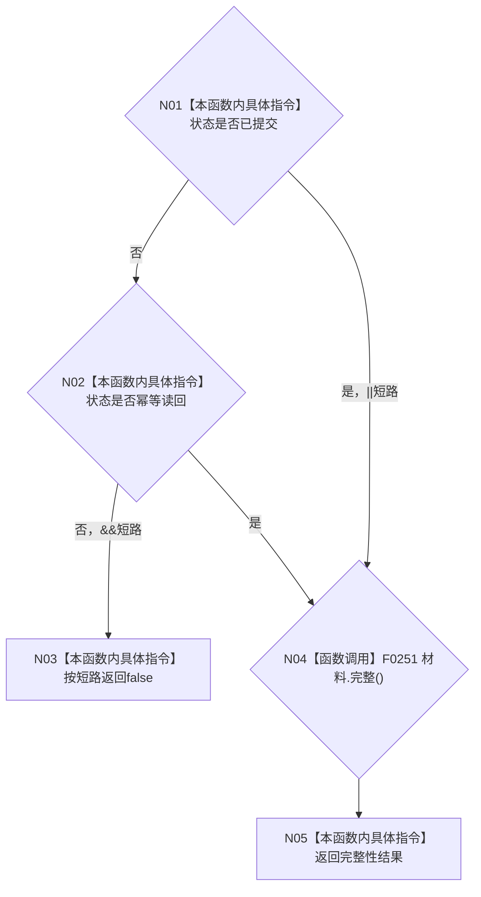

# CF-L4-0040 `概念活动初始化结果::成功` 现状流程图

图类型：现状流程图
代码版本：`a48a70b2d678dea64dd8228adb4f26f0badd9506`
覆盖文件：`海中鱼巣/领域/概念活动状态.数据.h:206-214`
唯一根函数：F0076
完整签名：`bool 海中鱼巣::概念活动初始化结果::成功() const noexcept`
参数：无；隐式 `this` 只读；返回：成功状态且活动材料完整时为 true

允许状态只决定是否进入材料完整性检查，不能单独形成成功。函数纯只读、`noexcept`、零外部调用、零未解析调用。
