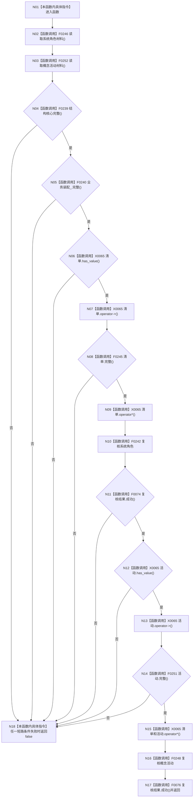

# CF-L4-0041 `运行期上下文::完整` 现状流程图

图类型：现状流程图
代码版本：`a48a70b2d678dea64dd8228adb4f26f0badd9506`
覆盖文件：`海中鱼巣/启动.运行期上下文.ixx:74-81`
唯一根函数：F0077
完整签名：`bool 海中鱼巣::运行期上下文::完整() const`
参数：无；隐式 `this` 只读；返回：本次复制材料及全部复核是否通过

两份材料在任何短路验证之前无条件、分锁顺序复制，因此不是同一原子快照。true 只证明本次调用中的复制材料和业务复核通过，不证明已经发布或返回后持续完整。未解析调用 0。
