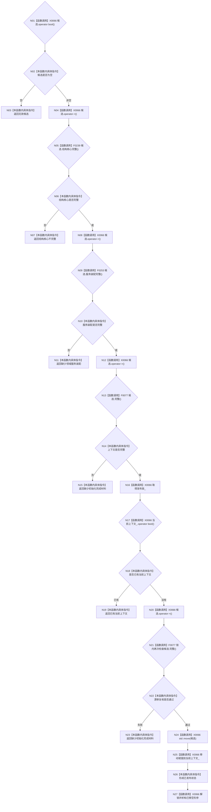

# CF-L4-0042 `运行期上下文宿主::尝试首次发布全新上下文` 现状流程图

图类型：现状流程图
代码版本：`a48a70b2d678dea64dd8228adb4f26f0badd9506`
覆盖文件：`海中鱼巣/启动.运行期上下文.ixx:208-231`
唯一根函数：F0078
完整签名：`海中鱼巣::运行期上下文发布状态 海中鱼巣::运行期上下文宿主::尝试首次发布全新上下文(std::shared_ptr<海中鱼巣::运行期上下文> 候选)`
参数：按值取得候选共享所有权份额；返回：结构化发布状态

第 229 行移动赋值是唯一宿主发布提交点。锁外预检不改变宿主，锁内再次复核完整性；发布锁只保护共享指针可见性，不是候选内部结构事务锁。未解析调用 0。
