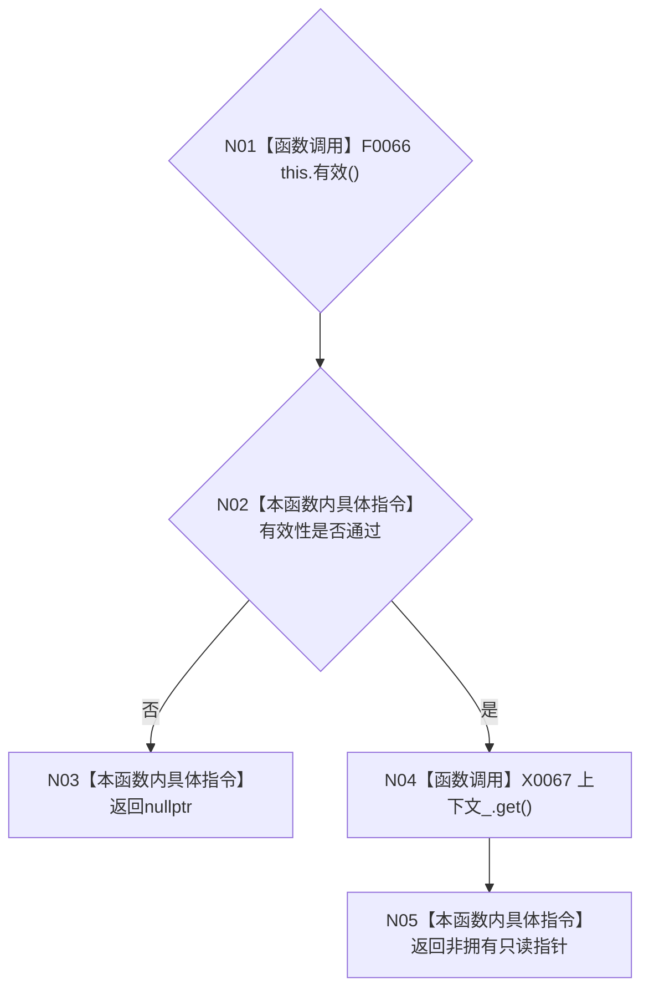

# CF-L4-0043 `运行期上下文租约::读取` 现状流程图

图类型：现状流程图
代码版本：`a48a70b2d678dea64dd8228adb4f26f0badd9506`
覆盖文件：`海中鱼巣/启动.运行期上下文.ixx:196`
唯一根函数：F0079
完整签名：`const 海中鱼巣::运行期上下文* 海中鱼巣::运行期上下文租约::读取() const`
参数：无；隐式 `this` 只读；返回：当前通过有效性检查时的非拥有只读裸指针，否则 `nullptr`

本函数不复制 `shared_ptr`、不增加引用计数。返回指针的生命周期依赖租约或其它共享所有者继续存活；非空只证明刚才的深层有效性谓词通过，不构成版本冻结。未解析调用 0。
