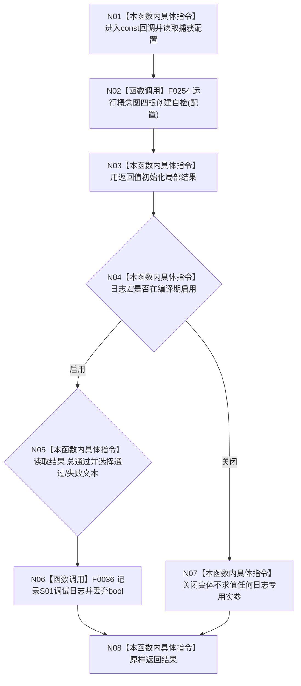

# CF-L4-0044 入口初始化 S01 回调 lambda 现状流程图

图类型：现状流程图
代码版本：`a48a70b2d678dea64dd8228adb4f26f0badd9506`
覆盖文件：`海中鱼巣/自检.入口初始化.ixx:486`
唯一根函数：F0080
完整签名：`海中鱼巣::自检单元结果 海中鱼巣::登记入口初始化自检单元(海中鱼巣::自检运行器&, const 海中鱼巣::入口初始化自检运行配置&)::<lambda@自检.入口初始化.ixx:486>::operator()() const`
参数：无；闭包按值持有只读配置副本；返回：S01 结构化自检结果

日志是编译期条件化人读旁路；其返回值不参与自检裁决。lambda 本身不创建隔离上下文，隔离数据生命周期属于 F0254。未解析调用 0。
