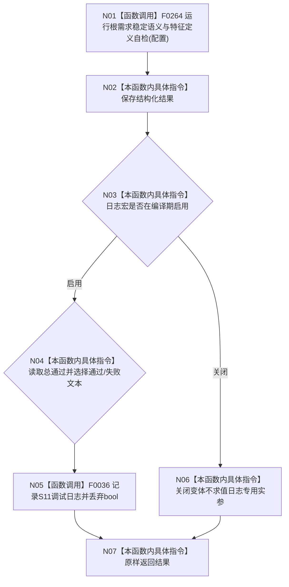

# CF-L4-0054 入口初始化 S11 回调 lambda 现状流程图

图类型：现状流程图
代码版本：`a48a70b2d678dea64dd8228adb4f26f0badd9506`
覆盖文件：`海中鱼巣/自检.入口初始化.ixx:506`
唯一根函数：F0090
完整签名：`海中鱼巣::自检单元结果 海中鱼巣::登记入口初始化自检单元(...)::<lambda@自检.入口初始化.ixx:506>::operator()() const`
参数：无；按值捕获只读配置；返回：S11 结构化自检结果

本图不展开 F0264 的稳定键、特征定义或隔离环境核对。未解析调用 0。
