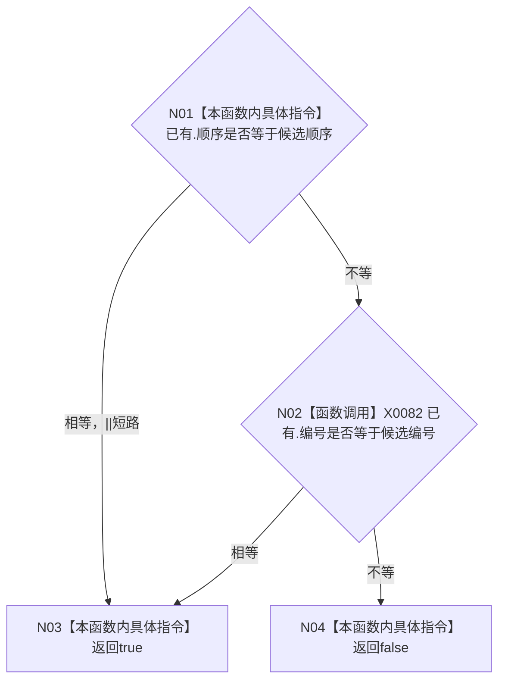

# CF-L4-0058 自检登记重复判定 lambda 现状流程图

图类型：现状流程图
代码版本：`a48a70b2d678dea64dd8228adb4f26f0badd9506`
覆盖文件：`海中鱼巣/自检.运行器.ixx:50-52`
唯一根函数：F0094
完整签名：`bool 海中鱼巣::自检运行器::登记自检(...)::<lambda@自检.运行器.ixx:50>::operator()(const 海中鱼巣::自检运行器::自检登记& 已有) const`
参数：只读借用当前登记；按引用捕获候选 `顺序`和`编号`；返回：任一唯一键冲突时 true

lambda 只读比较，不捕获 `this`，不修改登记容器。项目调用 0、未解析调用 0。
