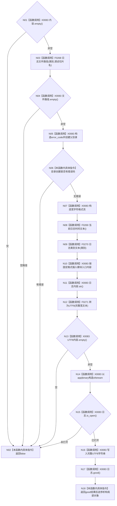

# CF-L4-0059 `写入日志` 现状流程图

图类型：现状流程图
代码版本：`a48a70b2d678dea64dd8228adb4f26f0badd9506`
覆盖文件：`海中鱼巣/核心/日志系统.h:218-254`
唯一根函数：F0095
完整签名：`bool 海中鱼巣::写入日志(海中鱼巣::日志类别 类别, std::wstring_view 模块, std::wstring_view 入口, std::wstring_view 内容, std::wstring_view 调试切片名 = {})`
参数：类别按值、四个只读非拥有视图；返回：当前流程观察到的写入状态

格式为 `[时间] 类别=… 模块=… 入口=…\n内容\n\n`，以 UTF-8 二进制追加。函数没有线程锁或文件锁；`good()` 在流析构关闭及最终刷新前计算，因此 true 不证明持久化成功。未解析调用 0。
