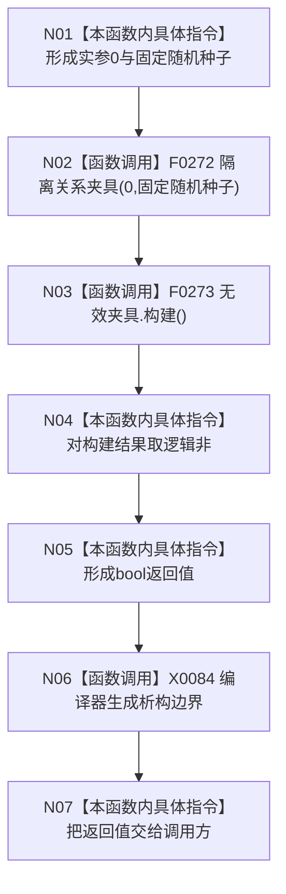

# CF-L4-0060 性能基线无效参数写前拒绝 lambda 现状流程图

图类型：现状流程图
代码版本：`a48a70b2d678dea64dd8228adb4f26f0badd9506`
覆盖文件：`海中鱼巣/核心/自检.关系仓库性能基线.ixx:877-880`
唯一根函数：F0096
完整签名：`bool 海中鱼巣::运行关系仓库性能基线自检()::<lambda@自检.关系仓库性能基线.ixx:877>::operator()() const`
参数：无；捕获：无；返回：`!无效夹具.构建()`，绑定到调用方的 `无效参数写前拒绝`

本函数只在 `HY_EGO_ENABLE_STRUCTURE_COMMIT_FAULT_SELF_TEST` 开启的配置中存在。构造或构建异常均在局部对象析构后向外传播；本函数不区分准入拒绝与其它 `构建()==false` 原因，也不独立读回零写入证据。未解析调用 0。
