# CF-L4-0061 `运行单规模基线` 现状流程图

图类型：现状流程图
代码版本：`a48a70b2d678dea64dd8228adb4f26f0badd9506`
覆盖文件：`海中鱼巣/核心/自检.关系仓库性能基线.ixx:756-855`
唯一根函数：F0097
完整签名：`海中鱼巣::关系仓库性能基线内部::规模报告 海中鱼巣::关系仓库性能基线内部::运行单规模基线(std::size_t 规模)`
参数：`规模` 按值；返回：按值 `规模报告`，夹具构建失败时返回部分填充报告

```mermaid
flowchart TD
    N01["N01【函数调用】X0085 默认构造规模报告"]
    N02["N02【本函数内具体指令】写入规模与固定种子"]
    N03["N03【函数调用】F0272 构造隔离关系夹具(规模,固定种子)"]
    N04["N04【函数调用】X0085 steady_clock::now()"]
    N05["N05【函数调用】F0273 夹具.构建()"]
    N06{"N06【本函数内具体指令】构建是否成功"}
    N07["N07【本函数内具体指令】返回部分报告"]
    N08["N08【函数调用】X0085 steady_clock::now()"]
    N09["N09【函数调用】F0274 夹具.当前签名()"]
    N10["N10【本函数内具体指令】写报告结构签名"]
    N11["N11【函数调用】F0275 夹具.初始当前记录数量()"]
    N12["N12【本函数内具体指令】写报告初始数量"]
    N13["N13【函数调用】F0276 夹具.分布完整()"]
    N14["N14【本函数内具体指令】写分布结果"]
    N15["N15【函数调用】F0277 夹具.验证结构边界()"]
    N16["N16【本函数内具体指令】写结构边界结果"]
    N17["N17【函数调用】F0278 夹具.形成查询定义组()"]
    N18["N18【函数调用】X0085 按查询数构造样本组与正确组"]
    N19["N19【本函数内具体指令】按规模选择批内重复数"]
    N20["N20【本函数内具体指令】初始化轮索引"]
    N21{"N21【本函数内具体指令】轮索引是否小于基线轮数"}
    N22["N22【函数调用】X0085 构造本轮汇总样本"]
    N23["N23【本函数内具体指令】初始化查询索引"]
    N24{"N24【本函数内具体指令】查询索引是否仍有效"}
    N25["N25【本函数内具体指令】绑定当前查询定义"]
    N26["N26【本函数内具体指令】初始化预热次数与批内索引"]
    N27{"N27【本函数内具体指令】预热循环是否继续"}
    N28["N28【函数调用】F0279 夹具.执行查询(定义)"]
    N29["N29【本函数内具体指令】短路累计预热查询正确性"]
    N30["N30【本函数内具体指令】推进预热循环"]
    N31["N31【本函数内具体指令】初始化正式次数和批耗时"]
    N32{"N32【本函数内具体指令】正式测量循环是否继续"}
    N33["N33【函数调用】F0279 夹具.执行查询(定义)"]
    N34["N34【本函数内具体指令】累计耗时与正确性"]
    N35["N35【本函数内具体指令】推进正式批内循环"]
    N36["N36【本函数内具体指令】计算单次耗时"]
    N37["N37【函数调用】X0085 把耗时追加到查询样本与本轮样本"]
    N38["N38【本函数内具体指令】推进正式次数"]
    N39["N39【本函数内具体指令】推进查询索引"]
    N40["N40【函数调用】F0280 读取分位数(本轮样本,0.50)"]
    N41["N41【本函数内具体指令】写本轮中位数并推进轮索引"]
    N42["N42【本函数内具体指令】初始化指标索引"]
    N43{"N43【本函数内具体指令】指标索引是否仍有效"}
    N44["N44【函数调用】F0281 形成分位指标(名称,样本,候选上界,正确)"]
    N45["N45【函数调用】X0085 追加查询指标"]
    N46["N46【本函数内具体指令】推进指标索引"]
    N47["N47【函数调用】X0085 min_element/max_element"]
    N48["N48【本函数内具体指令】计算波动比例与稳定标志"]
    N49["N49【函数调用】F0282 运行并发基线(夹具,查询定义组[1],中位数)"]
    N50["N50【本函数内具体指令】写并发指标"]
    N51["N51【函数调用】F0283 夹具.验证参考表当前状态()"]
    N52["N52【本函数内具体指令】写参考模型结果"]
    N53["N53【函数调用】F0284 夹具.测量创建()"]
    N54["N54【函数调用】X0085 追加创建指标"]
    N55["N55【函数调用】F0285 夹具.测量失效()"]
    N56["N56【函数调用】X0085 追加失效指标"]
    N57["N57【函数调用】F0286 夹具.测量重挂()"]
    N58["N58【函数调用】X0085 追加重挂指标"]
    N59["N59【函数调用】F0287 夹具.测量删除()"]
    N60["N60【函数调用】X0085 追加删除指标"]
    N61["N61【函数调用】F0288 夹具.读取关系仓库()"]
    N62["N62【函数调用】F0198 关系仓库.有效关系数量()"]
    N63["N63【本函数内具体指令】比较规模并写数量守恒"]
    N64["N64【函数调用】X0085 计算构建毫秒"]
    N65["N65【函数调用】X0085 经std::cout输出构建和轮次报告"]
    N66{"N66【本函数内具体指令】查询指标是否遍历完成"}
    N67["N67【函数调用】X0085 经std::cout输出当前查询指标"]
    N68{"N68【本函数内具体指令】写入指标是否遍历完成"}
    N69["N69【函数调用】X0085 经std::cout输出当前写入指标"]
    N70["N70【函数调用】X0085 经std::cout输出并发报告"]
    N71["N71【本函数内具体指令】返回规模报告"]
    N01 --> N02 --> N03 --> N04 --> N05 --> N06
    N06 -- "否" --> N07
    N06 -- "是" --> N08 --> N09 --> N10 --> N11 --> N12 --> N13 --> N14 --> N15 --> N16 --> N17 --> N18 --> N19 --> N20 --> N21
    N21 -- "是" --> N22 --> N23 --> N24
    N24 -- "是" --> N25 --> N26 --> N27
    N27 -- "是" --> N28 --> N29 --> N30 --> N27
    N27 -- "否" --> N31 --> N32
    N32 -- "是" --> N33 --> N34 --> N35 --> N32
    N32 -- "否" --> N36 --> N37 --> N38 --> N32
    N24 -- "当前查询的正式次数完成" --> N39 --> N24
    N24 -- "否" --> N40 --> N41 --> N21
    N21 -- "否" --> N42 --> N43
    N43 -- "是" --> N44 --> N45 --> N46 --> N43
    N43 -- "否" --> N47 --> N48 --> N49 --> N50 --> N51 --> N52 --> N53 --> N54 --> N55 --> N56 --> N57 --> N58 --> N59 --> N60 --> N61 --> N62 --> N63 --> N64 --> N65 --> N66
    N66 -- "否" --> N67 --> N66
    N66 -- "是" --> N68
    N68 -- "否" --> N69 --> N68
    N68 -- "是" --> N70 --> N71
```

本函数没有异常收口，分配、夹具、算法、并发基线和输出异常均传播。`查询定义组[1]` 与 `查询指标组[1]` 依赖上游隐式数量前置；逐项报告直接旁路 `std::cout`。未解析调用 0。
