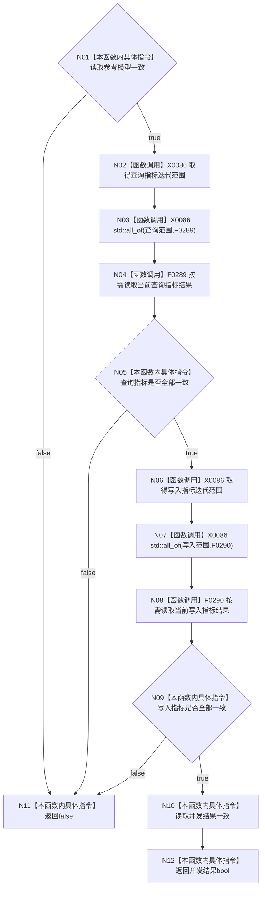

# CF-L4-0062 性能基线报告结果一致 lambda 现状流程图

图类型：现状流程图
代码版本：`a48a70b2d678dea64dd8228adb4f26f0badd9506`
覆盖文件：`海中鱼巣/核心/自检.关系仓库性能基线.ixx:902-911`
唯一根函数：F0098
完整签名：`bool 海中鱼巣::运行关系仓库性能基线自检()::<lambda@自检.关系仓库性能基线.ixx:902>::operator()<海中鱼巣::关系仓库性能基线内部::规模报告>(const 海中鱼巣::关系仓库性能基线内部::规模报告& 报告) const`
参数：`报告` 为非拥有只读引用；捕获：无；返回：四级结果一致短路链的 bool

两个 `all_of` 的 `begin()`、`end()` 与谓词实参间求值次序不固定，但无共享副作用。空指标组按标准算法返回 true；首个 false 会短路后续元素和外层条件。本函数不重算机器事实，只汇总报告中的既有 bool。未解析调用 0。
