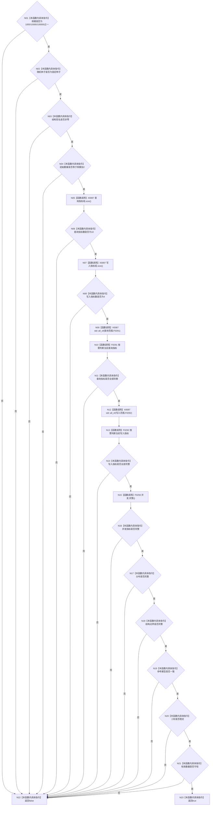

# CF-L4-0063 `规模报告::完整` 现状流程图

图类型：现状流程图
代码版本：`a48a70b2d678dea64dd8228adb4f26f0badd9506`
覆盖文件：`海中鱼巣/核心/自检.关系仓库性能基线.ixx:732-753`
唯一根函数：F0099
完整签名：`bool 海中鱼巣::关系仓库性能基线内部::规模报告::完整() const`
参数：无显式参数，隐式 `this` 为只读借用；返回：全部短路条件成立时 true，否则 false

两个算法回调 F0291/F0292 是独立函数，内部过程留待各自流程图展开；F0099 不直接调用其内部被调函数。函数只信任多项预计算 bool，不定位失败字段或指标。未解析调用 0。
