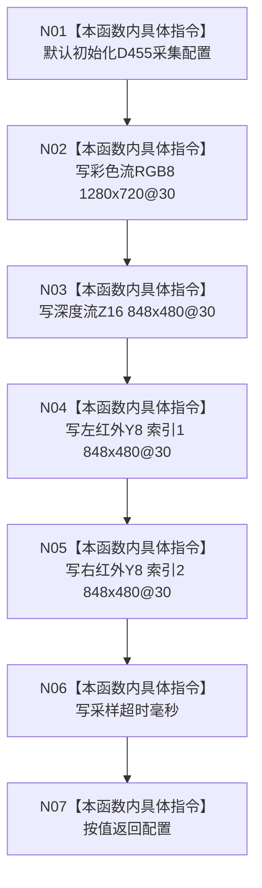

# CF-L4-0064 `生成D455默认采集配置` 现状流程图

图类型：现状流程图
代码版本：`a48a70b2d678dea64dd8228adb4f26f0badd9506`
覆盖文件：`海中鱼巣/适配/协议.D455采样材料.ixx:169-177`
唯一根函数：F0100
完整签名：`inline 海中鱼巣::D455采集配置 海中鱼巣::生成D455默认采集配置(std::uint32_t 超时毫秒 = 2000)`
参数：`超时毫秒` 按值；默认实参由调用点提供；返回：按值配置材料，无显式失败结果

本函数不调用项目源码函数；字符串和隐式聚合生命周期统一登记为 X0088。它只生成请求材料，不验证设备支持或配置有效性，超时 0 仍可被返回。未解析调用 0。
