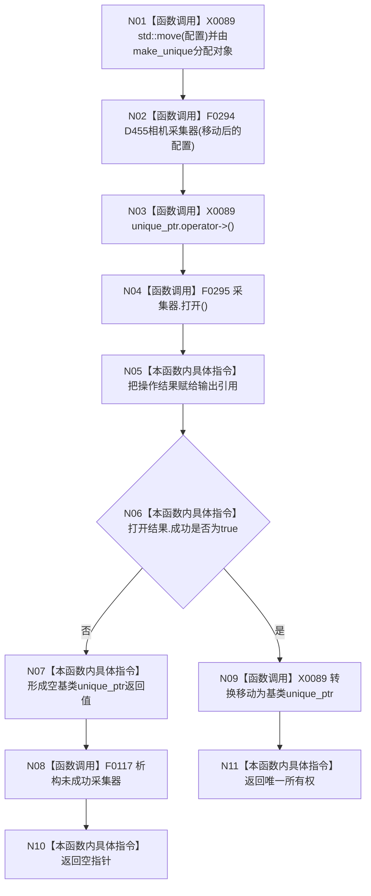

# CF-L4-0065 `创建并打开D455相机采集器` 现状流程图

图类型：现状流程图
代码版本：`a48a70b2d678dea64dd8228adb4f26f0badd9506`
覆盖文件：`海中鱼巣/适配/采集器.D455相机.ixx:746-755`
唯一根函数：F0101
完整签名：`std::unique_ptr<海中鱼巣::D455帧来源> 海中鱼巣::创建并打开D455相机采集器(海中鱼巣::D455采集配置 配置, 海中鱼巣::D455操作结果& 打开结果)`
参数：`配置` 按值并被移动；`打开结果` 为调用方拥有的可写引用；返回：成功时转移唯一所有权，正常失败时返回空指针

该定义只存在于 x64 且启用 RealSense 的工程变体；没有“宏关闭返回空”的运行路径。函数本身不直接调用 RealSense API。分配、构造或打开未收口异常会传播；异常发生在结果赋值前时输出引用保留调用方旧值。未解析调用 0。
