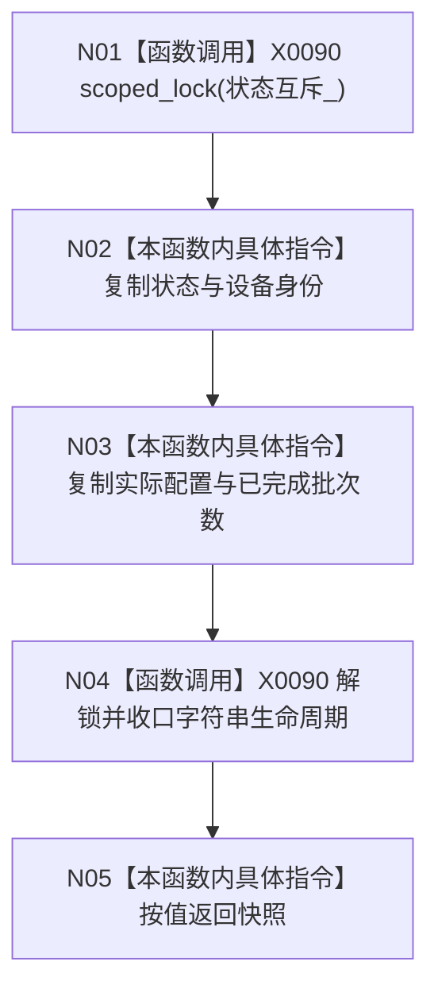

# CF-L4-0066 `D455相机采集器::读取状态快照` 现状流程图

图类型：现状流程图
代码版本：`a48a70b2d678dea64dd8228adb4f26f0badd9506`
覆盖文件：`海中鱼巣/适配/采集器.D455相机.ixx:713-716`
唯一根函数：F0102
完整签名：`海中鱼巣::D455采集状态快照 海中鱼巣::D455相机采集器::读取状态快照() const`
参数：无显式参数，隐式 `this` 为只读借用；返回：四字段按值快照

锁覆盖四字段的一致复制；返回后快照独立拥有字符串和配置副本。锁取得或字符串复制异常向外传播，函数未声明 `noexcept`。项目调用 0，未解析调用 0。
