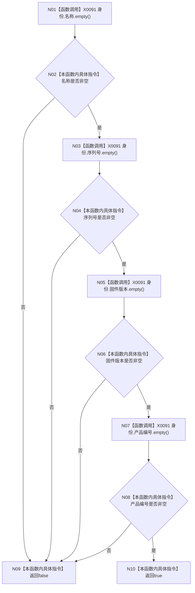

# CF-L4-0067 `D455设备身份有效` 现状流程图

图类型：现状流程图
代码版本：`a48a70b2d678dea64dd8228adb4f26f0badd9506`
覆盖文件：`海中鱼巣/适配/协议.D455采样材料.ixx:219-224`
唯一根函数：F0103
完整签名：`inline bool 海中鱼巣::D455设备身份有效(const 海中鱼巣::D455设备身份材料& 身份) noexcept`
参数：`身份` 为非拥有只读引用；返回：四个字符串均非空时 true

项目调用 0；四次 `std::string::empty()` 统一登记为 X0091。true 只证明非空，不证明编码、格式、字段一致性、设备在线或确为 D455。未解析调用 0。
