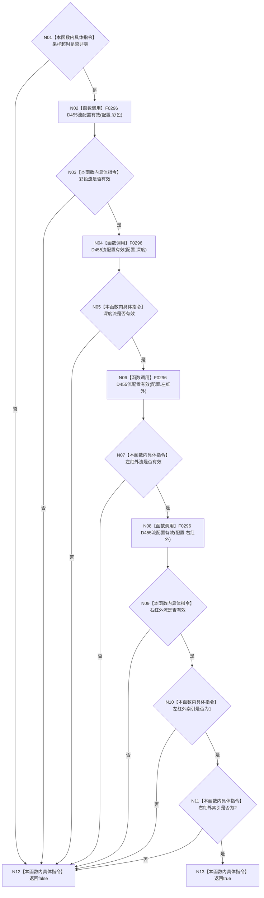

# CF-L4-0068 `D455采集配置有效` 现状流程图

图类型：现状流程图
代码版本：`a48a70b2d678dea64dd8228adb4f26f0badd9506`
覆盖文件：`海中鱼巣/适配/协议.D455采样材料.ixx:196-204`
唯一根函数：F0104
完整签名：`inline bool 海中鱼巣::D455采集配置有效(const 海中鱼巣::D455采集配置& 配置) noexcept`
参数：`配置` 为非拥有只读引用；返回：超时和四流静态形状、左右角色索引均通过时 true

同一项目函数 F0296 在四个不同调用点接收四个不同流配置，调用边不得合并。函数不接触设备或 SDK，true 不证明设备支持组合配置。未解析调用 0。
