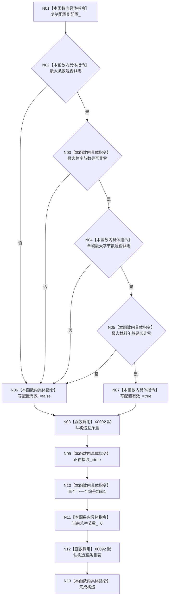

# CF-L4-0069 `D455帧材料缓存::D455帧材料缓存` 现状流程图

图类型：现状流程图
代码版本：`a48a70b2d678dea64dd8228adb4f26f0badd9506`
覆盖文件：`海中鱼巣/线程/缓存.D455帧材料.ixx:119-124,331-338`
唯一根函数：F0105
完整签名：`海中鱼巣::D455帧材料缓存::D455帧材料缓存(海中鱼巣::D455帧材料缓存配置 配置) noexcept`
参数：配置按值；返回：构造函数无返回，正常完成形成不可复制、不可移动缓存对象

实际初始化顺序由成员声明决定。无效配置仍形成对象且初始 `正在接收_=true`；`noexcept` 使互斥量或哈希表构造异常触发终止。项目调用 0，未解析调用 0。
