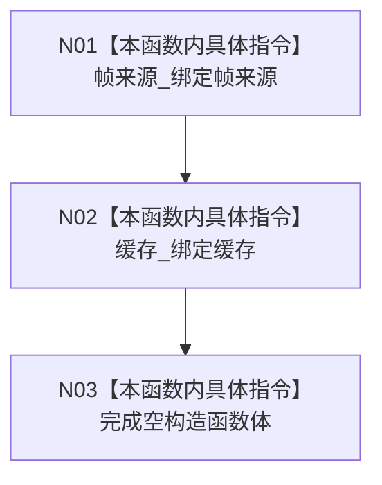

# CF-L4-0070 `D455采样材料上行桥::D455采样材料上行桥` 现状流程图

图类型：现状流程图
代码版本：`a48a70b2d678dea64dd8228adb4f26f0badd9506`
覆盖文件：`海中鱼巣/线程/上行桥.D455采样材料.ixx:50-52,189-190`
唯一根函数：F0106
完整签名：`海中鱼巣::D455采样材料上行桥::D455采样材料上行桥(海中鱼巣::D455帧来源& 帧来源, 海中鱼巣::D455帧材料缓存& 缓存) noexcept`
参数：两个调用方拥有的非 const 左值引用；返回：构造函数无返回，只保存非拥有别名

桥不取得所有权、不验证配对关系、不建立线程安全，也不在析构时关闭依赖。两个依赖必须比桥存活更久。项目调用和外部边界均为 0，未解析调用 0。
